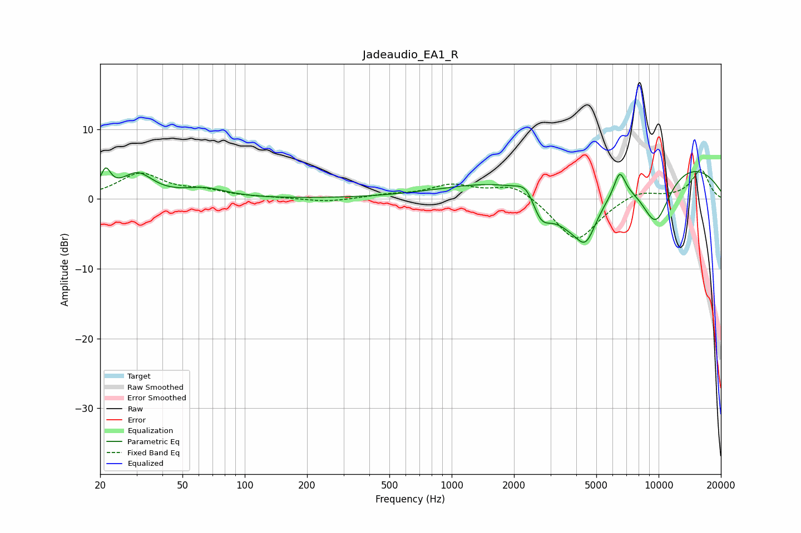

# Jadeaudio_EA1_R
See [usage instructions](https://github.com/jaakkopasanen/AutoEq#usage) for more options and info.

### Parametric EQs
Apply preamp of -4.6 dB when using parametric equalizer.

|   # | Type    |   Fc (Hz) |    Q |   Gain (dB) |
|-----|---------|-----------|------|-------------|
|   1 | Peaking |        21 | 5.86 |         3.2 |
|   2 | Peaking |        30 | 1.9  |         3.4 |
|   3 | Peaking |        64 | 1.35 |         1.3 |
|   4 | Peaking |      2312 | 3.13 |         2.2 |
|   5 | Peaking |      2692 | 2.91 |        -3.7 |
|   6 | Peaking |      3921 | 0.95 |        -8.8 |
|   7 | Peaking |      4464 | 3.03 |        -3.8 |
|   8 | Peaking |      6485 | 5.1  |         3.4 |
|   9 | Peaking |      6978 | 0.18 |         7   |
|  10 | Peaking |      9674 | 1.61 |        -8.3 |

### Fixed Band EQs
When using fixed band (also called graphic) equalizer, apply preamp of **-4.3 dB** (if available) and set gains manually with these parameters.

|   # | Type    |   Fc (Hz) |    Q |   Gain (dB) |
|-----|---------|-----------|------|-------------|
|   1 | Peaking |        31 | 1.41 |         3.5 |
|   2 | Peaking |        62 | 1.41 |         1   |
|   3 | Peaking |       125 | 1.41 |         0.2 |
|   4 | Peaking |       250 | 1.41 |        -0.5 |
|   5 | Peaking |       500 | 1.41 |         0.5 |
|   6 | Peaking |      1000 | 1.41 |         1.9 |
|   7 | Peaking |      2000 | 1.41 |         2.2 |
|   8 | Peaking |      4000 | 1.41 |        -6.3 |
|   9 | Peaking |      8000 | 1.41 |         1.3 |
|  10 | Peaking |     16000 | 1.41 |         4.2 |

### Graphs

