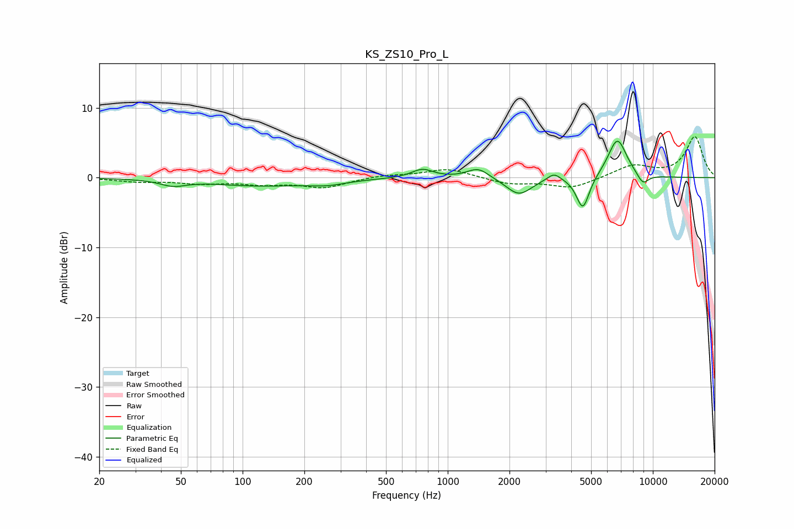

# KS_ZS10_Pro_L
See [usage instructions](https://github.com/jaakkopasanen/AutoEq#usage) for more options and info.

### Parametric EQs
Apply preamp of -5.3 dB when using parametric equalizer.

|   # | Type    |   Fc (Hz) |    Q |   Gain (dB) |
|-----|---------|-----------|------|-------------|
|   1 | Peaking |        46 | 2.31 |        -0.9 |
|   2 | Peaking |       121 | 0.59 |        -1.1 |
|   3 | Peaking |       258 | 1.51 |        -0.6 |
|   4 | Peaking |       752 | 2.68 |         1.3 |
|   5 | Peaking |      1406 | 2.67 |         1.5 |
|   6 | Peaking |      2223 | 2.29 |        -2.5 |
|   7 | Peaking |      3296 | 4.35 |         1.1 |
|   8 | Peaking |      4557 | 4.44 |        -4.8 |
|   9 | Peaking |      6711 | 2.91 |         5.7 |
|  10 | Peaking |      8935 | 4.48 |        -1.6 |

### Fixed Band EQs
When using fixed band (also called graphic) equalizer, apply preamp of **-6.0 dB** (if available) and set gains manually with these parameters.

|   # | Type    |   Fc (Hz) |    Q |   Gain (dB) |
|-----|---------|-----------|------|-------------|
|   1 | Peaking |        31 | 1.41 |        -0.5 |
|   2 | Peaking |        62 | 1.41 |        -0.7 |
|   3 | Peaking |       125 | 1.41 |        -0.8 |
|   4 | Peaking |       250 | 1.41 |        -1.4 |
|   5 | Peaking |       500 | 1.41 |         0.4 |
|   6 | Peaking |      1000 | 1.41 |         1.3 |
|   7 | Peaking |      2000 | 1.41 |        -0.9 |
|   8 | Peaking |      4000 | 1.41 |        -1.5 |
|   9 | Peaking |      8000 | 1.41 |         1.7 |
|  10 | Peaking |     16000 | 1.41 |         5.8 |

### Graphs

