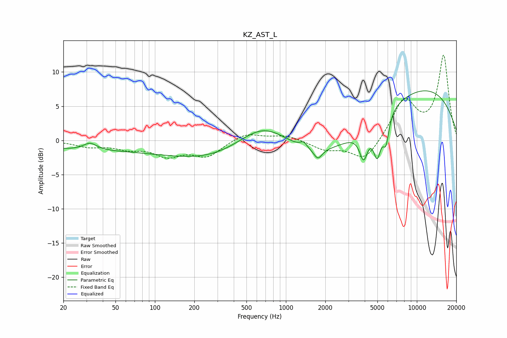

# KZ_AST_L
See [usage instructions](https://github.com/jaakkopasanen/AutoEq#usage) for more options and info.

### Parametric EQs
Apply preamp of -7.3 dB when using parametric equalizer.

|   # | Type    |   Fc (Hz) |    Q |   Gain (dB) |
|-----|---------|-----------|------|-------------|
|   1 | Peaking |        32 | 2.81 |         1   |
|   2 | Peaking |        45 | 0.18 |        -1.4 |
|   3 | Peaking |       678 | 0.62 |         6.6 |
|   4 | Peaking |      1031 | 0.19 |        -5.5 |
|   5 | Peaking |      1365 | 5.92 |         0.8 |
|   6 | Peaking |      1756 | 4.47 |        -1.5 |
|   7 | Peaking |      3922 | 4.51 |        -4   |
|   8 | Peaking |      4982 | 4.71 |        -4.9 |
|   9 | Peaking |      5805 | 6    |        -3.8 |
|  10 | Peaking |      9883 | 0.27 |         8.1 |

### Fixed Band EQs
When using fixed band (also called graphic) equalizer, apply preamp of **-12.5 dB** (if available) and set gains manually with these parameters.

|   # | Type    |   Fc (Hz) |    Q |   Gain (dB) |
|-----|---------|-----------|------|-------------|
|   1 | Peaking |        31 | 1.41 |        -0.8 |
|   2 | Peaking |        62 | 1.41 |        -1   |
|   3 | Peaking |       125 | 1.41 |        -2   |
|   4 | Peaking |       250 | 1.41 |        -2.2 |
|   5 | Peaking |       500 | 1.41 |         1.2 |
|   6 | Peaking |      1000 | 1.41 |         0.8 |
|   7 | Peaking |      2000 | 1.41 |        -1.3 |
|   8 | Peaking |      4000 | 1.41 |        -3.1 |
|   9 | Peaking |      8000 | 1.41 |         5.8 |
|  10 | Peaking |     16000 | 1.41 |        12.3 |

### Graphs

