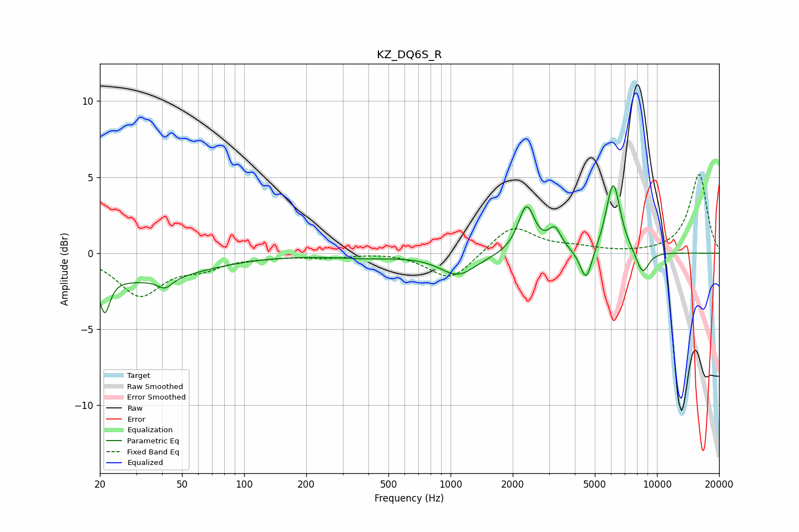

# KZ_DQ6S_R
See [usage instructions](https://github.com/jaakkopasanen/AutoEq#usage) for more options and info.

### Parametric EQs
Apply preamp of -4.5 dB when using parametric equalizer.

|   # | Type    |   Fc (Hz) |    Q |   Gain (dB) |
|-----|---------|-----------|------|-------------|
|   1 | Peaking |        21 | 5.77 |        -2.4 |
|   2 | Peaking |        31 | 0.48 |        -1.7 |
|   3 | Peaking |        41 | 4.05 |        -0.7 |
|   4 | Peaking |       387 | 0.9  |        -0.2 |
|   5 | Peaking |      1087 | 1.61 |        -1.4 |
|   6 | Peaking |      2331 | 3.56 |         3.1 |
|   7 | Peaking |      3201 | 4.5  |         1.4 |
|   8 | Peaking |      4540 | 4.79 |        -2.2 |
|   9 | Peaking |      6138 | 3.94 |         4.7 |
|  10 | Peaking |      8510 | 4.09 |        -1.6 |

### Fixed Band EQs
When using fixed band (also called graphic) equalizer, apply preamp of **-5.3 dB** (if available) and set gains manually with these parameters.

|   # | Type    |   Fc (Hz) |    Q |   Gain (dB) |
|-----|---------|-----------|------|-------------|
|   1 | Peaking |        31 | 1.41 |        -2.7 |
|   2 | Peaking |        62 | 1.41 |        -0.8 |
|   3 | Peaking |       125 | 1.41 |        -0.2 |
|   4 | Peaking |       250 | 1.41 |        -0.2 |
|   5 | Peaking |       500 | 1.41 |         0.1 |
|   6 | Peaking |      1000 | 1.41 |        -1.8 |
|   7 | Peaking |      2000 | 1.41 |         1.9 |
|   8 | Peaking |      4000 | 1.41 |         0.3 |
|   9 | Peaking |      8000 | 1.41 |        -0   |
|  10 | Peaking |     16000 | 1.41 |         5.2 |

### Graphs

