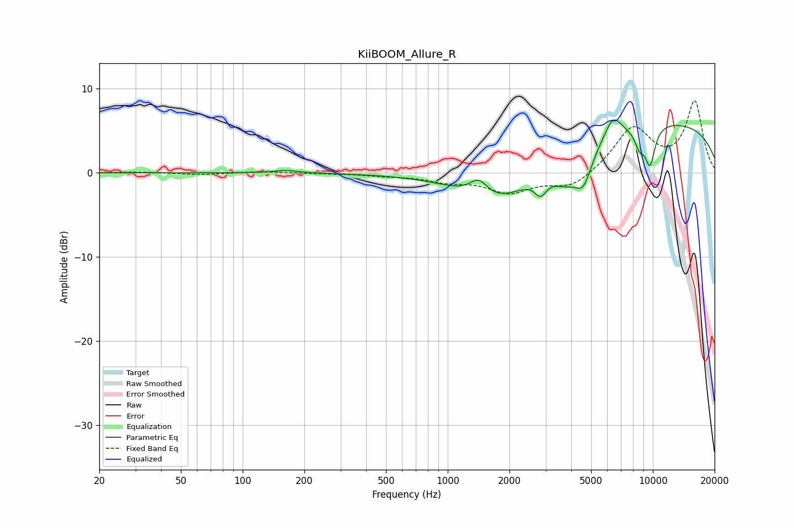

# KiiBOOM_Allure_R
See [usage instructions](https://github.com/jaakkopasanen/AutoEq#usage) for more options and info.

### Parametric EQs
Apply preamp of -6.4 dB when using parametric equalizer.

|   # | Type    |   Fc (Hz) |    Q |   Gain (dB) |
|-----|---------|-----------|------|-------------|
|   1 | Peaking |       162 | 2.43 |         0.3 |
|   2 | Peaking |      1415 | 3.22 |         2   |
|   3 | Peaking |      1777 | 0.75 |        -4.8 |
|   4 | Peaking |      2837 | 4.9  |        -1.9 |
|   5 | Peaking |      3747 | 1.95 |        -2.9 |
|   6 | Peaking |      4586 | 3.19 |        -3.9 |
|   7 | Peaking |      6399 | 3.5  |         2.4 |
|   8 | Peaking |      8610 | 5.18 |        -2.1 |
|   9 | Peaking |      9686 | 4.99 |        -4.5 |
|  10 | Peaking |     10000 | 0.21 |         6.2 |

### Fixed Band EQs
When using fixed band (also called graphic) equalizer, apply preamp of **-8.7 dB** (if available) and set gains manually with these parameters.

|   # | Type    |   Fc (Hz) |    Q |   Gain (dB) |
|-----|---------|-----------|------|-------------|
|   1 | Peaking |        31 | 1.41 |         0.1 |
|   2 | Peaking |        62 | 1.41 |        -0.2 |
|   3 | Peaking |       125 | 1.41 |         0.2 |
|   4 | Peaking |       250 | 1.41 |        -0.1 |
|   5 | Peaking |       500 | 1.41 |        -0.3 |
|   6 | Peaking |      1000 | 1.41 |        -0.9 |
|   7 | Peaking |      2000 | 1.41 |        -2.2 |
|   8 | Peaking |      4000 | 1.41 |        -1.8 |
|   9 | Peaking |      8000 | 1.41 |         5.3 |
|  10 | Peaking |     16000 | 1.41 |         8.4 |

### Graphs

