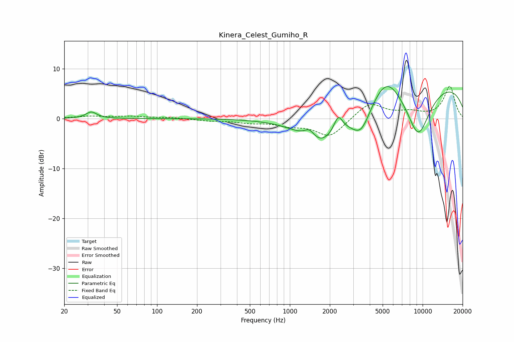

# Kinera_Celest_Gumiho_R
See [usage instructions](https://github.com/jaakkopasanen/AutoEq#usage) for more options and info.

### Parametric EQs
Apply preamp of -6.5 dB when using parametric equalizer.

|   # | Type    |   Fc (Hz) |    Q |   Gain (dB) |
|-----|---------|-----------|------|-------------|
|   1 | Peaking |        32 | 3.56 |         1.3 |
|   2 | Peaking |      1405 | 3.55 |         1.9 |
|   3 | Peaking |      1680 | 0.9  |        -6.4 |
|   4 | Peaking |      1742 | 2.14 |        -0.3 |
|   5 | Peaking |      2316 | 4.39 |         3.1 |
|   6 | Peaking |      3106 | 1.14 |        -1.6 |
|   7 | Peaking |      3457 | 1.97 |        -4.9 |
|   8 | Peaking |      5346 | 1.33 |         4.7 |
|   9 | Peaking |      9248 | 1.27 |       -11   |
|  10 | Peaking |     10000 | 0.2  |         7.8 |

### Fixed Band EQs
When using fixed band (also called graphic) equalizer, apply preamp of **-6.5 dB** (if available) and set gains manually with these parameters.

|   # | Type    |   Fc (Hz) |    Q |   Gain (dB) |
|-----|---------|-----------|------|-------------|
|   1 | Peaking |        31 | 1.41 |         0.4 |
|   2 | Peaking |        62 | 1.41 |         0.4 |
|   3 | Peaking |       125 | 1.41 |         0.2 |
|   4 | Peaking |       250 | 1.41 |        -0.4 |
|   5 | Peaking |       500 | 1.41 |        -0.7 |
|   6 | Peaking |      1000 | 1.41 |        -1.1 |
|   7 | Peaking |      2000 | 1.41 |        -3.7 |
|   8 | Peaking |      4000 | 1.41 |         3.2 |
|   9 | Peaking |      8000 | 1.41 |         1.1 |
|  10 | Peaking |     16000 | 1.41 |         6.4 |

### Graphs

