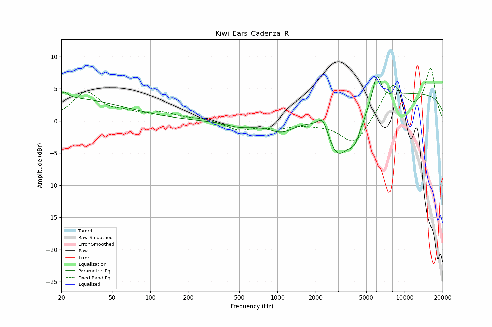

# Kiwi_Ears_Cadenza_R
See [usage instructions](https://github.com/jaakkopasanen/AutoEq#usage) for more options and info.

### Parametric EQs
Apply preamp of -7.0 dB when using parametric equalizer.

|   # | Type    |   Fc (Hz) |    Q |   Gain (dB) |
|-----|---------|-----------|------|-------------|
|   1 | Peaking |        20 | 0.29 |         3.6 |
|   2 | Peaking |        21 | 5.96 |        -1.8 |
|   3 | Peaking |        21 | 5.81 |         2.7 |
|   4 | Peaking |       511 | 1.21 |        -0.9 |
|   5 | Peaking |      1087 | 1.33 |        -1.9 |
|   6 | Peaking |      2273 | 3.63 |         2.4 |
|   7 | Peaking |      2989 | 1.51 |        -7.2 |
|   8 | Peaking |      4083 | 2.44 |        -3.9 |
|   9 | Peaking |      6067 | 4.11 |         4.4 |
|  10 | Peaking |     10000 | 0.18 |         4.4 |

### Fixed Band EQs
When using fixed band (also called graphic) equalizer, apply preamp of **-8.2 dB** (if available) and set gains manually with these parameters.

|   # | Type    |   Fc (Hz) |    Q |   Gain (dB) |
|-----|---------|-----------|------|-------------|
|   1 | Peaking |        31 | 1.41 |         4.3 |
|   2 | Peaking |        62 | 1.41 |         0.9 |
|   3 | Peaking |       125 | 1.41 |         1.1 |
|   4 | Peaking |       250 | 1.41 |         0.4 |
|   5 | Peaking |       500 | 1.41 |        -1.3 |
|   6 | Peaking |      1000 | 1.41 |        -0.9 |
|   7 | Peaking |      2000 | 1.41 |        -0.3 |
|   8 | Peaking |      4000 | 1.41 |        -3.9 |
|   9 | Peaking |      8000 | 1.41 |         5.6 |
|  10 | Peaking |     16000 | 1.41 |         7.9 |

### Graphs

