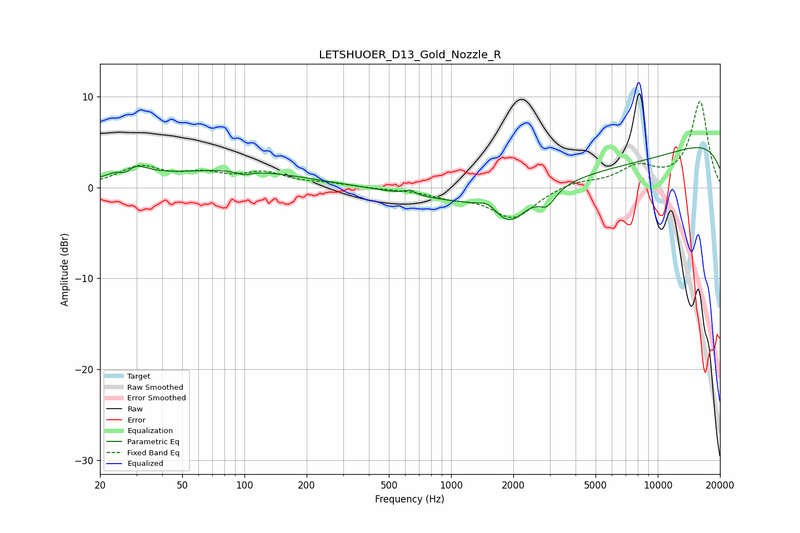

# LETSHUOER_D13_Gold_Nozzle_R
See [usage instructions](https://github.com/jaakkopasanen/AutoEq#usage) for more options and info.

### Parametric EQs
Apply preamp of -4.5 dB when using parametric equalizer.

|   # | Type    |   Fc (Hz) |    Q |   Gain (dB) |
|-----|---------|-----------|------|-------------|
|   1 | Peaking |        27 | 4.46 |        -1.2 |
|   2 | Peaking |        28 | 2.02 |         2.2 |
|   3 | Peaking |        86 | 0.4  |         1.9 |
|   4 | Peaking |       100 | 4.2  |        -0.4 |
|   5 | Peaking |       631 | 5.94 |         0.5 |
|   6 | Peaking |      1507 | 3.38 |         0.8 |
|   7 | Peaking |      1921 | 1.8  |        -3   |
|   8 | Peaking |      2922 | 3.56 |        -1.6 |
|   9 | Peaking |      3960 | 0.21 |        -3.9 |
|  10 | Peaking |     10000 | 0.18 |         6.4 |

### Fixed Band EQs
When using fixed band (also called graphic) equalizer, apply preamp of **-9.5 dB** (if available) and set gains manually with these parameters.

|   # | Type    |   Fc (Hz) |    Q |   Gain (dB) |
|-----|---------|-----------|------|-------------|
|   1 | Peaking |        31 | 1.41 |         2.1 |
|   2 | Peaking |        62 | 1.41 |         1.2 |
|   3 | Peaking |       125 | 1.41 |         1.4 |
|   4 | Peaking |       250 | 1.41 |         0.4 |
|   5 | Peaking |       500 | 1.41 |        -0.1 |
|   6 | Peaking |      1000 | 1.41 |        -0.9 |
|   7 | Peaking |      2000 | 1.41 |        -3.3 |
|   8 | Peaking |      4000 | 1.41 |         0.7 |
|   9 | Peaking |      8000 | 1.41 |         2.1 |
|  10 | Peaking |     16000 | 1.41 |         9.4 |

### Graphs

