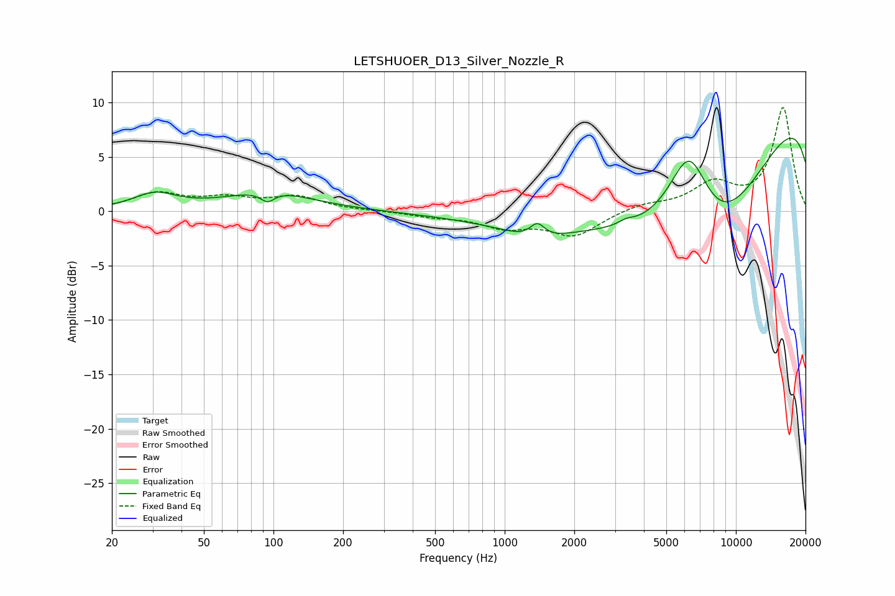

# LETSHUOER_D13_Silver_Nozzle_R
See [usage instructions](https://github.com/jaakkopasanen/AutoEq#usage) for more options and info.

### Parametric EQs
Apply preamp of -6.8 dB when using parametric equalizer.

|   # | Type    |   Fc (Hz) |    Q |   Gain (dB) |
|-----|---------|-----------|------|-------------|
|   1 | Peaking |        31 | 1.53 |         1.4 |
|   2 | Peaking |        94 | 4.72 |        -0.9 |
|   3 | Peaking |        96 | 0.76 |         1.7 |
|   4 | Peaking |      1366 | 1.29 |        -1.2 |
|   5 | Peaking |      1384 | 4.32 |         1.4 |
|   6 | Peaking |      3348 | 4.35 |         0.4 |
|   7 | Peaking |      3794 | 0.26 |        -5.9 |
|   8 | Peaking |      6283 | 1.36 |         9.3 |
|   9 | Peaking |      7686 | 0.44 |       -13.6 |
|  10 | Peaking |     10000 | 0.18 |        14.6 |

### Fixed Band EQs
When using fixed band (also called graphic) equalizer, apply preamp of **-9.6 dB** (if available) and set gains manually with these parameters.

|   # | Type    |   Fc (Hz) |    Q |   Gain (dB) |
|-----|---------|-----------|------|-------------|
|   1 | Peaking |        31 | 1.41 |         1.6 |
|   2 | Peaking |        62 | 1.41 |         1   |
|   3 | Peaking |       125 | 1.41 |         1.2 |
|   4 | Peaking |       250 | 1.41 |         0   |
|   5 | Peaking |       500 | 1.41 |        -0.4 |
|   6 | Peaking |      1000 | 1.41 |        -1.3 |
|   7 | Peaking |      2000 | 1.41 |        -2.2 |
|   8 | Peaking |      4000 | 1.41 |         0.6 |
|   9 | Peaking |      8000 | 1.41 |         2.4 |
|  10 | Peaking |     16000 | 1.41 |         9.5 |

### Graphs

