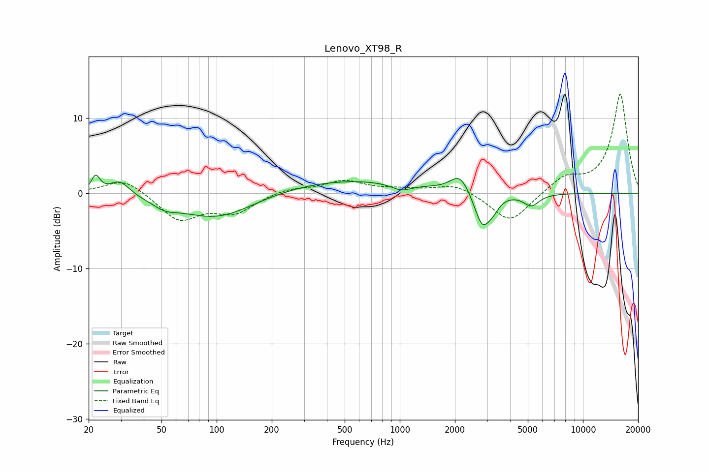

# Lenovo_XT98_R
See [usage instructions](https://github.com/jaakkopasanen/AutoEq#usage) for more options and info.

### Parametric EQs
Apply preamp of -2.5 dB when using parametric equalizer.

|   # | Type    |   Fc (Hz) |    Q |   Gain (dB) |
|-----|---------|-----------|------|-------------|
|   1 | Peaking |        22 | 5.99 |         2.2 |
|   2 | Peaking |        30 | 2.52 |         2   |
|   3 | Peaking |        52 | 2.23 |        -0.9 |
|   4 | Peaking |       100 | 0.67 |        -3.5 |
|   5 | Peaking |       496 | 0.35 |         1.9 |
|   6 | Peaking |      1018 | 2.47 |        -0.9 |
|   7 | Peaking |      2132 | 2.78 |         2.4 |
|   8 | Peaking |      2822 | 3.25 |        -4.6 |
|   9 | Peaking |      3229 | 4.37 |        -1.1 |
|  10 | Peaking |      5223 | 3.26 |        -1.6 |

### Fixed Band EQs
When using fixed band (also called graphic) equalizer, apply preamp of **-13.3 dB** (if available) and set gains manually with these parameters.

|   # | Type    |   Fc (Hz) |    Q |   Gain (dB) |
|-----|---------|-----------|------|-------------|
|   1 | Peaking |        31 | 1.41 |         2.1 |
|   2 | Peaking |        62 | 1.41 |        -3.6 |
|   3 | Peaking |       125 | 1.41 |        -2.4 |
|   4 | Peaking |       250 | 1.41 |         0.7 |
|   5 | Peaking |       500 | 1.41 |         1.6 |
|   6 | Peaking |      1000 | 1.41 |         0.4 |
|   7 | Peaking |      2000 | 1.41 |         1.3 |
|   8 | Peaking |      4000 | 1.41 |        -4   |
|   9 | Peaking |      8000 | 1.41 |         2   |
|  10 | Peaking |     16000 | 1.41 |        13.2 |

### Graphs

