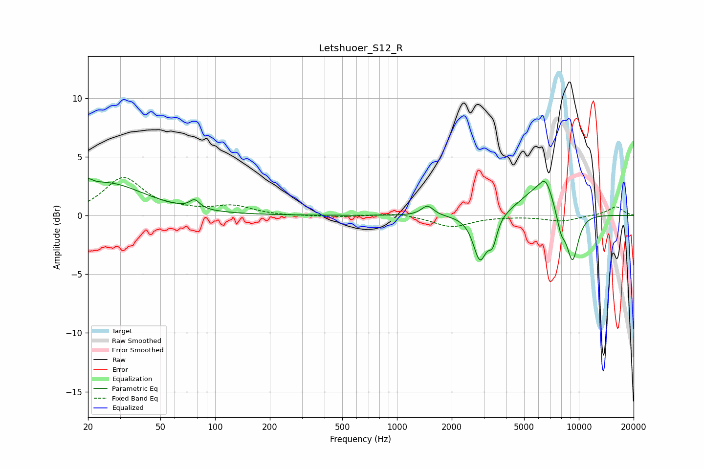

# Letshuoer_S12_R
See [usage instructions](https://github.com/jaakkopasanen/AutoEq#usage) for more options and info.

### Parametric EQs
Apply preamp of -3.2 dB when using parametric equalizer.

|   # | Type    |   Fc (Hz) |    Q |   Gain (dB) |
|-----|---------|-----------|------|-------------|
|   1 | Peaking |        20 | 5.81 |         0.6 |
|   2 | Peaking |        25 | 0.68 |         2.7 |
|   3 | Peaking |        77 | 5.31 |         0.7 |
|   4 | Peaking |      1471 | 4.37 |         0.8 |
|   5 | Peaking |      2858 | 3.86 |        -3.8 |
|   6 | Peaking |      3359 | 6    |        -1.9 |
|   7 | Peaking |      5832 | 1.33 |         2   |
|   8 | Peaking |      6578 | 3.67 |         1.7 |
|   9 | Peaking |      7982 | 5.19 |        -1.6 |
|  10 | Peaking |      9222 | 3.74 |        -4.2 |

### Fixed Band EQs
When using fixed band (also called graphic) equalizer, apply preamp of **-3.3 dB** (if available) and set gains manually with these parameters.

|   # | Type    |   Fc (Hz) |    Q |   Gain (dB) |
|-----|---------|-----------|------|-------------|
|   1 | Peaking |        31 | 1.41 |         3.1 |
|   2 | Peaking |        62 | 1.41 |         0.3 |
|   3 | Peaking |       125 | 1.41 |         0.7 |
|   4 | Peaking |       250 | 1.41 |        -0.1 |
|   5 | Peaking |       500 | 1.41 |        -0.1 |
|   6 | Peaking |      1000 | 1.41 |         0.2 |
|   7 | Peaking |      2000 | 1.41 |        -1   |
|   8 | Peaking |      4000 | 1.41 |        -0   |
|   9 | Peaking |      8000 | 1.41 |        -0.5 |
|  10 | Peaking |     16000 | 1.41 |         0.8 |

### Graphs

