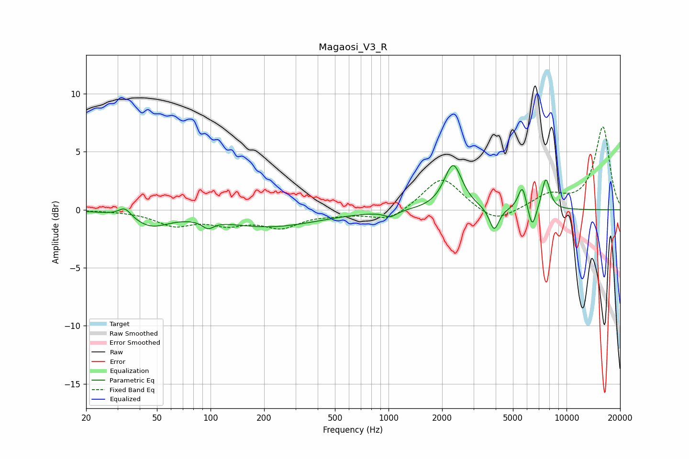

# Magaosi_V3_R
See [usage instructions](https://github.com/jaakkopasanen/AutoEq#usage) for more options and info.

### Parametric EQs
Apply preamp of -3.9 dB when using parametric equalizer.

|   # | Type    |   Fc (Hz) |    Q |   Gain (dB) |
|-----|---------|-----------|------|-------------|
|   1 | Peaking |        33 | 4.2  |         0.8 |
|   2 | Peaking |        46 | 1.42 |        -1.2 |
|   3 | Peaking |        97 | 4.43 |        -0.7 |
|   4 | Peaking |       214 | 0.51 |        -1.4 |
|   5 | Peaking |      1025 | 4.03 |        -0.5 |
|   6 | Peaking |      2306 | 2.83 |         3.9 |
|   7 | Peaking |      3923 | 5.23 |        -2   |
|   8 | Peaking |      5647 | 5.95 |         2.1 |
|   9 | Peaking |      6416 | 6    |        -2   |
|  10 | Peaking |      7655 | 5.81 |         2.8 |

### Fixed Band EQs
When using fixed band (also called graphic) equalizer, apply preamp of **-7.2 dB** (if available) and set gains manually with these parameters.

|   # | Type    |   Fc (Hz) |    Q |   Gain (dB) |
|-----|---------|-----------|------|-------------|
|   1 | Peaking |        31 | 1.41 |        -0   |
|   2 | Peaking |        62 | 1.41 |        -1.2 |
|   3 | Peaking |       125 | 1.41 |        -1   |
|   4 | Peaking |       250 | 1.41 |        -1.4 |
|   5 | Peaking |       500 | 1.41 |        -0.3 |
|   6 | Peaking |      1000 | 1.41 |        -1   |
|   7 | Peaking |      2000 | 1.41 |         2.9 |
|   8 | Peaking |      4000 | 1.41 |        -1.2 |
|   9 | Peaking |      8000 | 1.41 |         1.2 |
|  10 | Peaking |     16000 | 1.41 |         7.1 |

### Graphs

