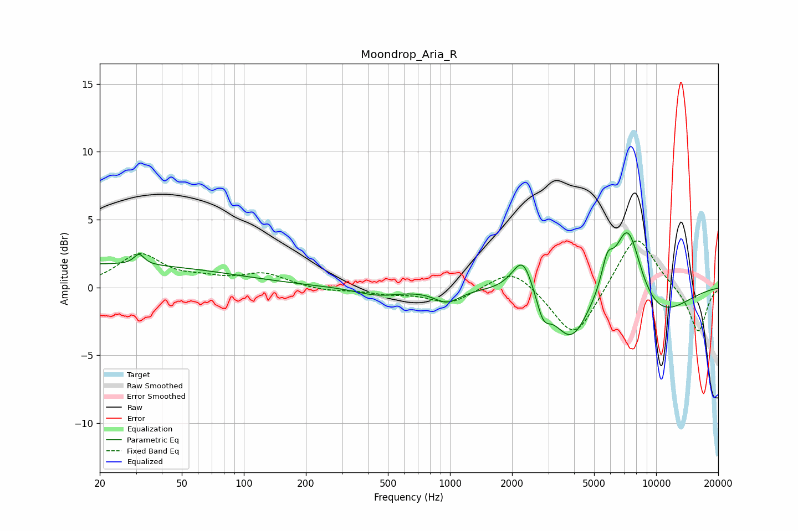

# Moondrop_Aria_R
See [usage instructions](https://github.com/jaakkopasanen/AutoEq#usage) for more options and info.

### Parametric EQs
Apply preamp of -4.1 dB when using parametric equalizer.

|   # | Type    |   Fc (Hz) |    Q |   Gain (dB) |
|-----|---------|-----------|------|-------------|
|   1 | Peaking |        20 | 0.21 |         1.7 |
|   2 | Peaking |        31 | 5.9  |         0.8 |
|   3 | Peaking |       446 | 1.29 |        -0.6 |
|   4 | Peaking |       967 | 2.25 |        -1   |
|   5 | Peaking |      2258 | 2.73 |         2.8 |
|   6 | Peaking |      2831 | 4.17 |        -1.7 |
|   7 | Peaking |      3863 | 1.66 |        -3.7 |
|   8 | Peaking |      5788 | 4.91 |         2   |
|   9 | Peaking |      7280 | 1.97 |         6.1 |
|  10 | Peaking |      9733 | 0.74 |        -2.5 |

### Fixed Band EQs
When using fixed band (also called graphic) equalizer, apply preamp of **-3.5 dB** (if available) and set gains manually with these parameters.

|   # | Type    |   Fc (Hz) |    Q |   Gain (dB) |
|-----|---------|-----------|------|-------------|
|   1 | Peaking |        31 | 1.41 |         2.4 |
|   2 | Peaking |        62 | 1.41 |         0.5 |
|   3 | Peaking |       125 | 1.41 |         1   |
|   4 | Peaking |       250 | 1.41 |        -0.3 |
|   5 | Peaking |       500 | 1.41 |        -0.4 |
|   6 | Peaking |      1000 | 1.41 |        -1.2 |
|   7 | Peaking |      2000 | 1.41 |         1.6 |
|   8 | Peaking |      4000 | 1.41 |        -3.9 |
|   9 | Peaking |      8000 | 1.41 |         4.1 |
|  10 | Peaking |     16000 | 1.41 |        -3.4 |

### Graphs

