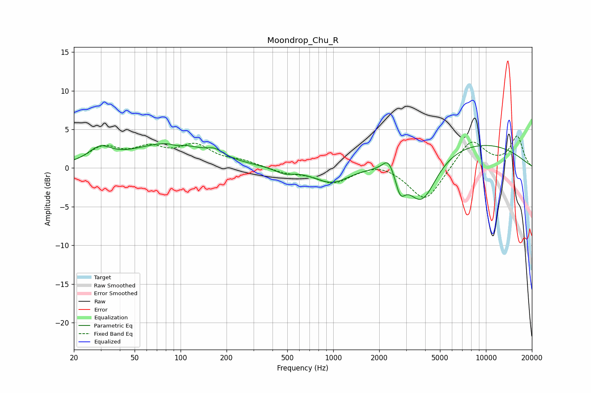

# Moondrop_Chu_R
See [usage instructions](https://github.com/jaakkopasanen/AutoEq#usage) for more options and info.

### Parametric EQs
Apply preamp of -3.2 dB when using parametric equalizer.

|   # | Type    |   Fc (Hz) |    Q |   Gain (dB) |
|-----|---------|-----------|------|-------------|
|   1 | Peaking |        30 | 1.89 |         1.9 |
|   2 | Peaking |        85 | 0.59 |         3.1 |
|   3 | Peaking |        94 | 4.77 |        -0.3 |
|   4 | Peaking |       168 | 2.77 |         0.8 |
|   5 | Peaking |       474 | 2.38 |        -0.7 |
|   6 | Peaking |       977 | 1.2  |        -2.1 |
|   7 | Peaking |      2299 | 3.79 |         1.9 |
|   8 | Peaking |      2749 | 4.49 |        -2.6 |
|   9 | Peaking |      3789 | 1.42 |        -6.5 |
|  10 | Peaking |      7581 | 0.31 |         3.5 |

### Fixed Band EQs
When using fixed band (also called graphic) equalizer, apply preamp of **-4.2 dB** (if available) and set gains manually with these parameters.

|   # | Type    |   Fc (Hz) |    Q |   Gain (dB) |
|-----|---------|-----------|------|-------------|
|   1 | Peaking |        31 | 1.41 |         2.4 |
|   2 | Peaking |        62 | 1.41 |         2.1 |
|   3 | Peaking |       125 | 1.41 |         2.6 |
|   4 | Peaking |       250 | 1.41 |         0.7 |
|   5 | Peaking |       500 | 1.41 |        -0.6 |
|   6 | Peaking |      1000 | 1.41 |        -1.9 |
|   7 | Peaking |      2000 | 1.41 |         0.8 |
|   8 | Peaking |      4000 | 1.41 |        -4.4 |
|   9 | Peaking |      8000 | 1.41 |         3.8 |
|  10 | Peaking |     16000 | 1.41 |         4   |

### Graphs

