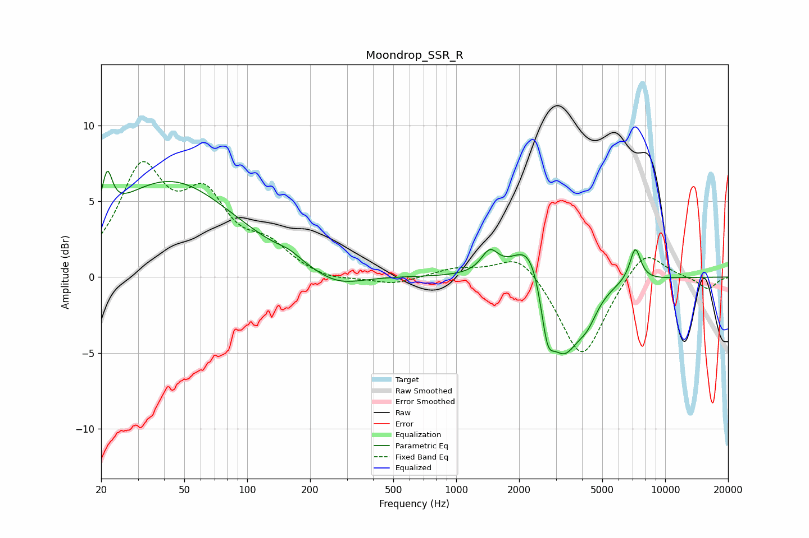

# Moondrop_SSR_R
See [usage instructions](https://github.com/jaakkopasanen/AutoEq#usage) for more options and info.

### Parametric EQs
Apply preamp of -7.1 dB when using parametric equalizer.

|   # | Type    |   Fc (Hz) |    Q |   Gain (dB) |
|-----|---------|-----------|------|-------------|
|   1 | Peaking |        21 | 5.93 |         2.7 |
|   2 | Peaking |        43 | 0.46 |         6.3 |
|   3 | Peaking |       159 | 2.72 |         0.3 |
|   4 | Peaking |       268 | 1.15 |        -1   |
|   5 | Peaking |      1447 | 3.52 |         1.4 |
|   6 | Peaking |      2297 | 1.71 |         3.5 |
|   7 | Peaking |      2725 | 4.47 |        -3.2 |
|   8 | Peaking |      3250 | 1.79 |        -5.2 |
|   9 | Peaking |      4233 | 2.79 |        -1.4 |
|  10 | Peaking |      7195 | 5.03 |         2.2 |

### Fixed Band EQs
When using fixed band (also called graphic) equalizer, apply preamp of **-7.7 dB** (if available) and set gains manually with these parameters.

|   # | Type    |   Fc (Hz) |    Q |   Gain (dB) |
|-----|---------|-----------|------|-------------|
|   1 | Peaking |        31 | 1.41 |         6.7 |
|   2 | Peaking |        62 | 1.41 |         4.6 |
|   3 | Peaking |       125 | 1.41 |         1.7 |
|   4 | Peaking |       250 | 1.41 |        -0.4 |
|   5 | Peaking |       500 | 1.41 |        -0.5 |
|   6 | Peaking |      1000 | 1.41 |         0.5 |
|   7 | Peaking |      2000 | 1.41 |         1.7 |
|   8 | Peaking |      4000 | 1.41 |        -5.5 |
|   9 | Peaking |      8000 | 1.41 |         2   |
|  10 | Peaking |     16000 | 1.41 |        -0.8 |

### Graphs

