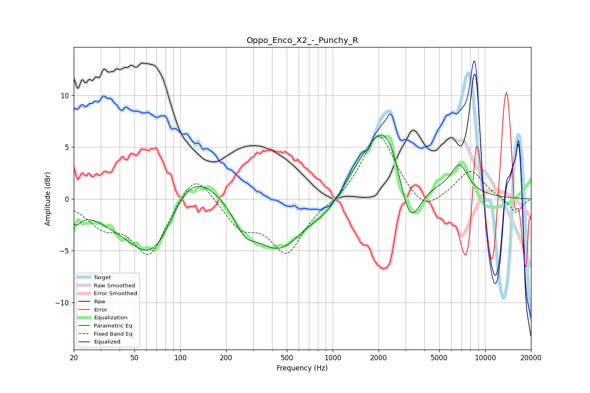

# Oppo_Enco_X2_-_Punchy_R
See [usage instructions](https://github.com/jaakkopasanen/AutoEq#usage) for more options and info.

### Parametric EQs
Apply preamp of -6.3 dB when using parametric equalizer.

|   # | Type    |   Fc (Hz) |    Q |   Gain (dB) |
|-----|---------|-----------|------|-------------|
|   1 | Peaking |        21 | 4.16 |        -1.4 |
|   2 | Peaking |        33 | 2.1  |        -0.1 |
|   3 | Peaking |        69 | 0.74 |        -8.7 |
|   4 | Peaking |       110 | 0.74 |         6.7 |
|   5 | Peaking |       265 | 2    |        -2.1 |
|   6 | Peaking |       443 | 0.88 |        -5   |
|   7 | Peaking |       909 | 1.31 |        -1.5 |
|   8 | Peaking |      2305 | 0.87 |         9.6 |
|   9 | Peaking |      3167 | 1.67 |        -8   |
|  10 | Peaking |      6800 | 2.45 |         2.7 |

### Fixed Band EQs
When using fixed band (also called graphic) equalizer, apply preamp of **-6.1 dB** (if available) and set gains manually with these parameters.

|   # | Type    |   Fc (Hz) |    Q |   Gain (dB) |
|-----|---------|-----------|------|-------------|
|   1 | Peaking |        31 | 1.41 |        -2.2 |
|   2 | Peaking |        62 | 1.41 |        -5.4 |
|   3 | Peaking |       125 | 1.41 |         3.2 |
|   4 | Peaking |       250 | 1.41 |        -2.5 |
|   5 | Peaking |       500 | 1.41 |        -5   |
|   6 | Peaking |      1000 | 1.41 |        -0.3 |
|   7 | Peaking |      2000 | 1.41 |         6.5 |
|   8 | Peaking |      4000 | 1.41 |        -1.7 |
|   9 | Peaking |      8000 | 1.41 |         2.8 |
|  10 | Peaking |     16000 | 1.41 |        -1.4 |

### Graphs

