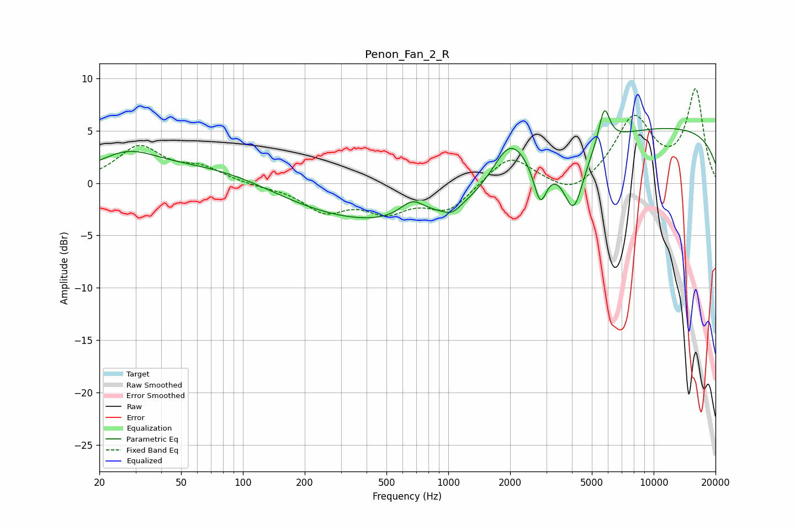

# Penon_Fan_2_R
See [usage instructions](https://github.com/jaakkopasanen/AutoEq#usage) for more options and info.

### Parametric EQs
Apply preamp of -7.0 dB when using parametric equalizer.

|   # | Type    |   Fc (Hz) |    Q |   Gain (dB) |
|-----|---------|-----------|------|-------------|
|   1 | Peaking |        27 | 0.93 |         2.4 |
|   2 | Peaking |        81 | 0.46 |         2   |
|   3 | Peaking |       585 | 0.21 |        -4.3 |
|   4 | Peaking |       669 | 2.31 |         1.7 |
|   5 | Peaking |      1045 | 3.34 |        -0.8 |
|   6 | Peaking |      1993 | 1.65 |         4.3 |
|   7 | Peaking |      2805 | 4.47 |        -3.8 |
|   8 | Peaking |      4080 | 2.85 |        -5.6 |
|   9 | Peaking |      5749 | 5.23 |         3.5 |
|  10 | Peaking |     10000 | 0.18 |         5.4 |

### Fixed Band EQs
When using fixed band (also called graphic) equalizer, apply preamp of **-9.1 dB** (if available) and set gains manually with these parameters.

|   # | Type    |   Fc (Hz) |    Q |   Gain (dB) |
|-----|---------|-----------|------|-------------|
|   1 | Peaking |        31 | 1.41 |         3.4 |
|   2 | Peaking |        62 | 1.41 |         1.3 |
|   3 | Peaking |       125 | 1.41 |        -0.2 |
|   4 | Peaking |       250 | 1.41 |        -2.5 |
|   5 | Peaking |       500 | 1.41 |        -2.3 |
|   6 | Peaking |      1000 | 1.41 |        -2.5 |
|   7 | Peaking |      2000 | 1.41 |         2.8 |
|   8 | Peaking |      4000 | 1.41 |        -1.5 |
|   9 | Peaking |      8000 | 1.41 |         6.1 |
|  10 | Peaking |     16000 | 1.41 |         8.7 |

### Graphs

