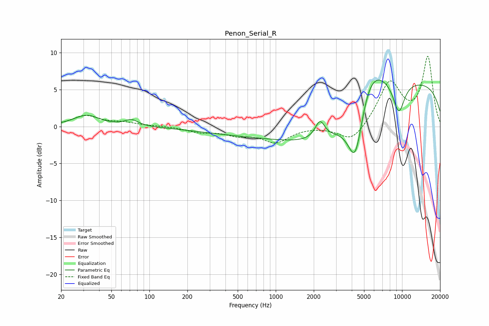

# Penon_Serial_R
See [usage instructions](https://github.com/jaakkopasanen/AutoEq#usage) for more options and info.

### Parametric EQs
Apply preamp of -6.4 dB when using parametric equalizer.

|   # | Type    |   Fc (Hz) |    Q |   Gain (dB) |
|-----|---------|-----------|------|-------------|
|   1 | Peaking |        32 | 1.39 |         1.5 |
|   2 | Peaking |        72 | 2.73 |         0.9 |
|   3 | Peaking |      1361 | 0.18 |        -1.3 |
|   4 | Peaking |      2238 | 3.7  |         2.4 |
|   5 | Peaking |      3433 | 0.4  |        -4.8 |
|   6 | Peaking |      3898 | 0.54 |        -1.4 |
|   7 | Peaking |      4274 | 2.21 |        -8.7 |
|   8 | Peaking |      5431 | 0.9  |         8.5 |
|   9 | Peaking |      9422 | 2.71 |        -4.3 |
|  10 | Peaking |      9538 | 0.18 |         6.5 |

### Fixed Band EQs
When using fixed band (also called graphic) equalizer, apply preamp of **-9.6 dB** (if available) and set gains manually with these parameters.

|   # | Type    |   Fc (Hz) |    Q |   Gain (dB) |
|-----|---------|-----------|------|-------------|
|   1 | Peaking |        31 | 1.41 |         1.4 |
|   2 | Peaking |        62 | 1.41 |         0.4 |
|   3 | Peaking |       125 | 1.41 |         0.1 |
|   4 | Peaking |       250 | 1.41 |        -0.7 |
|   5 | Peaking |       500 | 1.41 |        -1   |
|   6 | Peaking |      1000 | 1.41 |        -2   |
|   7 | Peaking |      2000 | 1.41 |         0.1 |
|   8 | Peaking |      4000 | 1.41 |        -2.3 |
|   9 | Peaking |      8000 | 1.41 |         5.9 |
|  10 | Peaking |     16000 | 1.41 |         9.3 |

### Graphs

