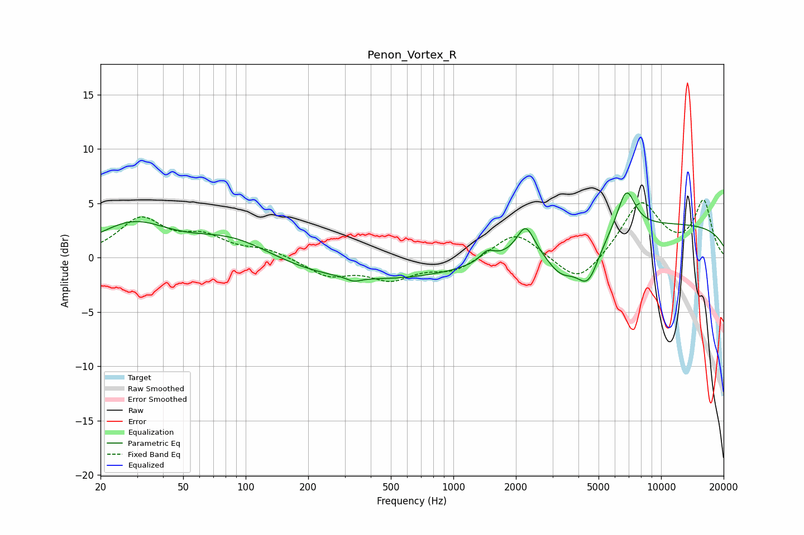

# Penon_Vortex_R
See [usage instructions](https://github.com/jaakkopasanen/AutoEq#usage) for more options and info.

### Parametric EQs
Apply preamp of -6.1 dB when using parametric equalizer.

|   # | Type    |   Fc (Hz) |    Q |   Gain (dB) |
|-----|---------|-----------|------|-------------|
|   1 | Peaking |        29 | 0.83 |         3   |
|   2 | Peaking |        88 | 0.66 |         2.9 |
|   3 | Peaking |       306 | 0.2  |        -2.3 |
|   4 | Peaking |       331 | 4.33 |        -0.4 |
|   5 | Peaking |      1458 | 4.23 |         0.9 |
|   6 | Peaking |      2228 | 3.39 |         2.7 |
|   7 | Peaking |      3311 | 1.87 |        -2.7 |
|   8 | Peaking |      4450 | 2.47 |        -3.8 |
|   9 | Peaking |      6795 | 3.09 |         3.8 |
|  10 | Peaking |     10000 | 0.18 |         3.1 |

### Fixed Band EQs
When using fixed band (also called graphic) equalizer, apply preamp of **-5.4 dB** (if available) and set gains manually with these parameters.

|   # | Type    |   Fc (Hz) |    Q |   Gain (dB) |
|-----|---------|-----------|------|-------------|
|   1 | Peaking |        31 | 1.41 |         3.4 |
|   2 | Peaking |        62 | 1.41 |         1.7 |
|   3 | Peaking |       125 | 1.41 |         0.7 |
|   4 | Peaking |       250 | 1.41 |        -1.6 |
|   5 | Peaking |       500 | 1.41 |        -1.8 |
|   6 | Peaking |      1000 | 1.41 |        -1.2 |
|   7 | Peaking |      2000 | 1.41 |         2.5 |
|   8 | Peaking |      4000 | 1.41 |        -2.7 |
|   9 | Peaking |      8000 | 1.41 |         5.1 |
|  10 | Peaking |     16000 | 1.41 |         5.1 |

### Graphs

