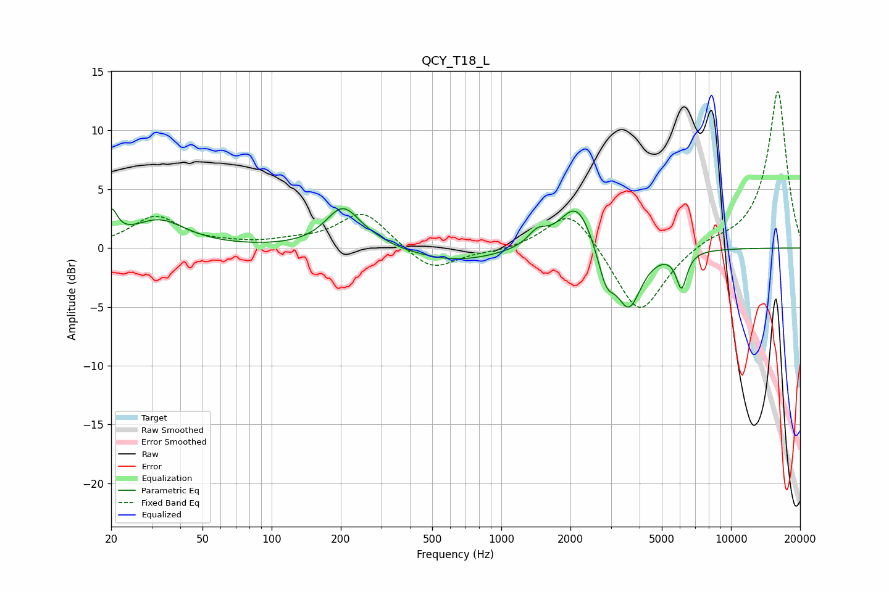

# QCY_T18_L
See [usage instructions](https://github.com/jaakkopasanen/AutoEq#usage) for more options and info.

### Parametric EQs
Apply preamp of -3.4 dB when using parametric equalizer.

|   # | Type    |   Fc (Hz) |    Q |   Gain (dB) |
|-----|---------|-----------|------|-------------|
|   1 | Peaking |        20 | 5.47 |         2.4 |
|   2 | Peaking |        32 | 1.2  |         2.3 |
|   3 | Peaking |       204 | 1.89 |         3.4 |
|   4 | Peaking |       281 | 1.81 |         0.3 |
|   5 | Peaking |       636 | 0.74 |        -1.2 |
|   6 | Peaking |      1437 | 3.46 |         1.2 |
|   7 | Peaking |      2130 | 1.92 |         4.1 |
|   8 | Peaking |      2860 | 3.86 |        -2.9 |
|   9 | Peaking |      3591 | 2.57 |        -5   |
|  10 | Peaking |      6094 | 5.94 |        -3   |

### Fixed Band EQs
When using fixed band (also called graphic) equalizer, apply preamp of **-13.4 dB** (if available) and set gains manually with these parameters.

|   # | Type    |   Fc (Hz) |    Q |   Gain (dB) |
|-----|---------|-----------|------|-------------|
|   1 | Peaking |        31 | 1.41 |         2.6 |
|   2 | Peaking |        62 | 1.41 |         0.2 |
|   3 | Peaking |       125 | 1.41 |         0.4 |
|   4 | Peaking |       250 | 1.41 |         3.1 |
|   5 | Peaking |       500 | 1.41 |        -2.1 |
|   6 | Peaking |      1000 | 1.41 |        -0.3 |
|   7 | Peaking |      2000 | 1.41 |         3.5 |
|   8 | Peaking |      4000 | 1.41 |        -5.9 |
|   9 | Peaking |      8000 | 1.41 |         0.6 |
|  10 | Peaking |     16000 | 1.41 |        13.4 |

### Graphs

