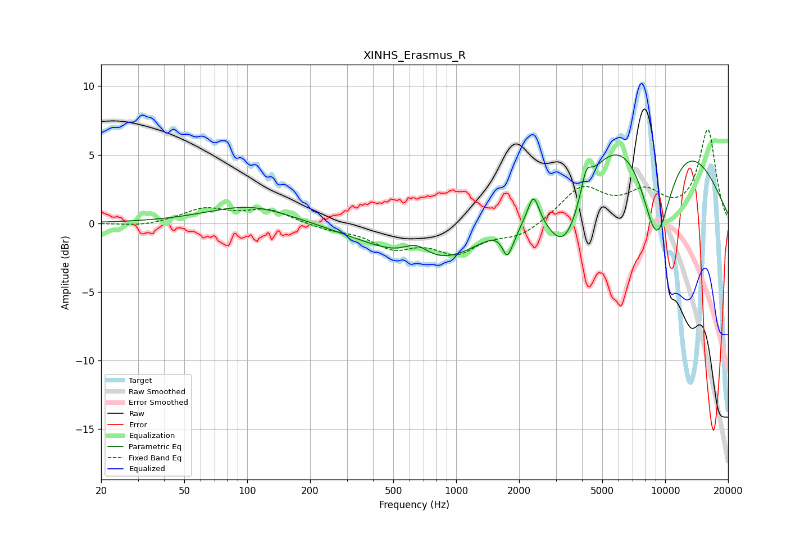

# XINHS_Erasmus_R
See [usage instructions](https://github.com/jaakkopasanen/AutoEq#usage) for more options and info.

### Parametric EQs
Apply preamp of -5.1 dB when using parametric equalizer.

|   # | Type    |   Fc (Hz) |    Q |   Gain (dB) |
|-----|---------|-----------|------|-------------|
|   1 | Peaking |       104 | 0.69 |         1.3 |
|   2 | Peaking |       642 | 2.32 |         1.1 |
|   3 | Peaking |       847 | 0.51 |        -3.6 |
|   4 | Peaking |      1755 | 5.92 |        -1.8 |
|   5 | Peaking |      1905 | 3.93 |        -0.7 |
|   6 | Peaking |      2344 | 5.44 |         2   |
|   7 | Peaking |      3311 | 1.42 |        -6.4 |
|   8 | Peaking |      4186 | 5.77 |         1.7 |
|   9 | Peaking |      7389 | 0.31 |         9.4 |
|  10 | Peaking |      9080 | 1.53 |        -9.1 |

### Fixed Band EQs
When using fixed band (also called graphic) equalizer, apply preamp of **-6.9 dB** (if available) and set gains manually with these parameters.

|   # | Type    |   Fc (Hz) |    Q |   Gain (dB) |
|-----|---------|-----------|------|-------------|
|   1 | Peaking |        31 | 1.41 |        -0.2 |
|   2 | Peaking |        62 | 1.41 |         1   |
|   3 | Peaking |       125 | 1.41 |         1   |
|   4 | Peaking |       250 | 1.41 |        -0.4 |
|   5 | Peaking |       500 | 1.41 |        -1.6 |
|   6 | Peaking |      1000 | 1.41 |        -1.9 |
|   7 | Peaking |      2000 | 1.41 |        -0.9 |
|   8 | Peaking |      4000 | 1.41 |         2.5 |
|   9 | Peaking |      8000 | 1.41 |         2   |
|  10 | Peaking |     16000 | 1.41 |         6.7 |

### Graphs

