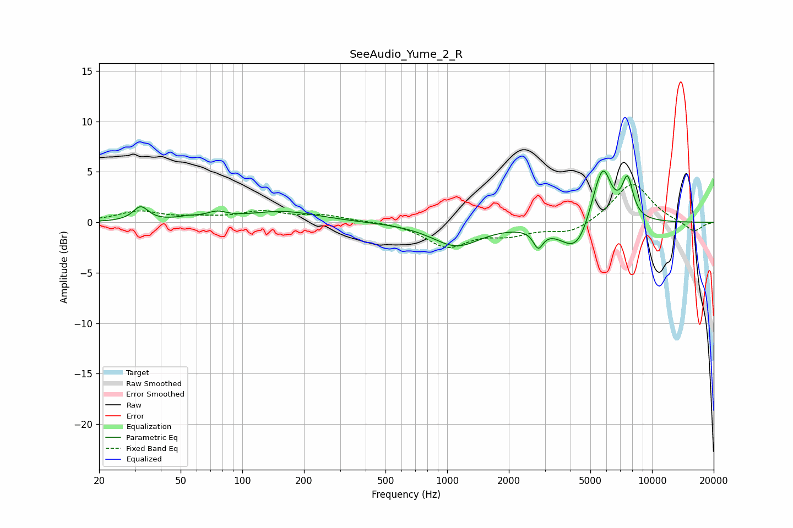

# SeeAudio_Yume_2_R
See [usage instructions](https://github.com/jaakkopasanen/AutoEq#usage) for more options and info.

### Parametric EQs
Apply preamp of -5.2 dB when using parametric equalizer.

|   # | Type    |   Fc (Hz) |    Q |   Gain (dB) |
|-----|---------|-----------|------|-------------|
|   1 | Peaking |        32 | 3.9  |         1.4 |
|   2 | Peaking |        54 | 2.58 |         0.3 |
|   3 | Peaking |        75 | 2.85 |         0.6 |
|   4 | Peaking |       157 | 0.83 |         1.1 |
|   5 | Peaking |      1110 | 1.19 |        -2.3 |
|   6 | Peaking |      2782 | 6    |        -1.7 |
|   7 | Peaking |      4342 | 1.76 |        -3.7 |
|   8 | Peaking |      5548 | 2.37 |         4.9 |
|   9 | Peaking |      5839 | 4.59 |         1.8 |
|  10 | Peaking |      7594 | 5.02 |         3.8 |

### Fixed Band EQs
When using fixed band (also called graphic) equalizer, apply preamp of **-3.8 dB** (if available) and set gains manually with these parameters.

|   # | Type    |   Fc (Hz) |    Q |   Gain (dB) |
|-----|---------|-----------|------|-------------|
|   1 | Peaking |        31 | 1.41 |         1   |
|   2 | Peaking |        62 | 1.41 |         0.3 |
|   3 | Peaking |       125 | 1.41 |         1   |
|   4 | Peaking |       250 | 1.41 |         0.6 |
|   5 | Peaking |       500 | 1.41 |         0.1 |
|   6 | Peaking |      1000 | 1.41 |        -2.3 |
|   7 | Peaking |      2000 | 1.41 |        -1   |
|   8 | Peaking |      4000 | 1.41 |        -1.1 |
|   9 | Peaking |      8000 | 1.41 |         4   |
|  10 | Peaking |     16000 | 1.41 |        -1   |

### Graphs

