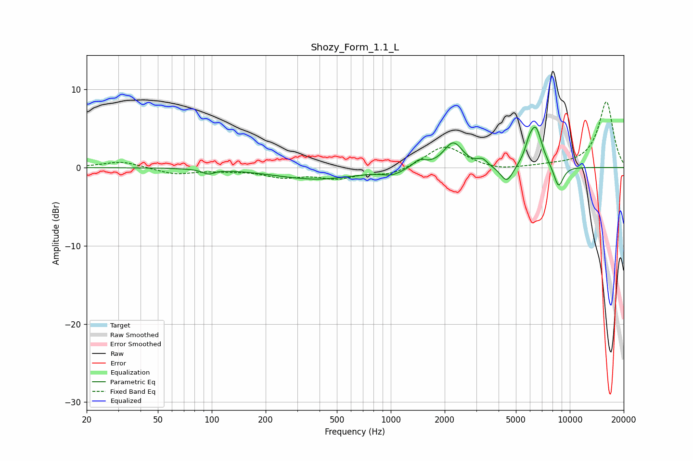

# Shozy_Form_1.1_L
See [usage instructions](https://github.com/jaakkopasanen/AutoEq#usage) for more options and info.

### Parametric EQs
Apply preamp of -5.3 dB when using parametric equalizer.

|   # | Type    |   Fc (Hz) |    Q |   Gain (dB) |
|-----|---------|-----------|------|-------------|
|   1 | Peaking |        96 | 4.42 |        -0.6 |
|   2 | Peaking |       382 | 0.61 |        -1.5 |
|   3 | Peaking |      1020 | 2.59 |        -0.7 |
|   4 | Peaking |      1442 | 3.94 |         0.9 |
|   5 | Peaking |      2233 | 2.7  |         3.2 |
|   6 | Peaking |      3254 | 5.43 |         0.8 |
|   7 | Peaking |      4448 | 3.84 |        -2.2 |
|   8 | Peaking |      5917 | 5.96 |         1.3 |
|   9 | Peaking |      6454 | 3.77 |         4.9 |
|  10 | Peaking |      8646 | 4.72 |        -2.8 |

### Fixed Band EQs
When using fixed band (also called graphic) equalizer, apply preamp of **-8.5 dB** (if available) and set gains manually with these parameters.

|   # | Type    |   Fc (Hz) |    Q |   Gain (dB) |
|-----|---------|-----------|------|-------------|
|   1 | Peaking |        31 | 1.41 |         0.8 |
|   2 | Peaking |        62 | 1.41 |        -0.8 |
|   3 | Peaking |       125 | 1.41 |        -0.3 |
|   4 | Peaking |       250 | 1.41 |        -1.1 |
|   5 | Peaking |       500 | 1.41 |        -1.2 |
|   6 | Peaking |      1000 | 1.41 |        -1   |
|   7 | Peaking |      2000 | 1.41 |         2.9 |
|   8 | Peaking |      4000 | 1.41 |        -0.5 |
|   9 | Peaking |      8000 | 1.41 |         0.2 |
|  10 | Peaking |     16000 | 1.41 |         8.4 |

### Graphs

