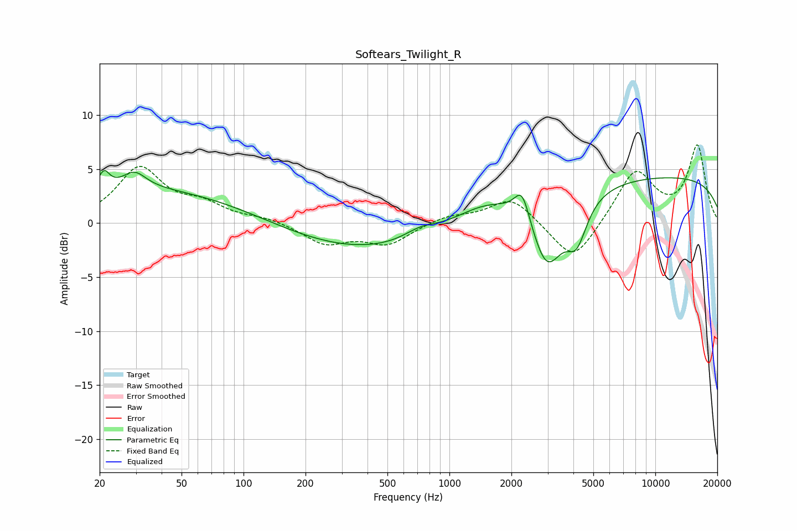

# Softears_Twilight_R
See [usage instructions](https://github.com/jaakkopasanen/AutoEq#usage) for more options and info.

### Parametric EQs
Apply preamp of -5.0 dB when using parametric equalizer.

|   # | Type    |   Fc (Hz) |    Q |   Gain (dB) |
|-----|---------|-----------|------|-------------|
|   1 | Peaking |        21 | 5.53 |         1.5 |
|   2 | Peaking |        30 | 2.51 |         1.5 |
|   3 | Peaking |        40 | 0.23 |         3.4 |
|   4 | Peaking |       328 | 0.3  |        -3   |
|   5 | Peaking |       722 | 1.76 |         0.9 |
|   6 | Peaking |      1502 | 0.85 |         1.8 |
|   7 | Peaking |      2256 | 3.79 |         2.9 |
|   8 | Peaking |      2976 | 1.79 |        -6.6 |
|   9 | Peaking |      4150 | 2.8  |        -3.7 |
|  10 | Peaking |     10000 | 0.18 |         4.3 |

### Fixed Band EQs
When using fixed band (also called graphic) equalizer, apply preamp of **-7.3 dB** (if available) and set gains manually with these parameters.

|   # | Type    |   Fc (Hz) |    Q |   Gain (dB) |
|-----|---------|-----------|------|-------------|
|   1 | Peaking |        31 | 1.41 |         5   |
|   2 | Peaking |        62 | 1.41 |         1.5 |
|   3 | Peaking |       125 | 1.41 |         0.4 |
|   4 | Peaking |       250 | 1.41 |        -1.9 |
|   5 | Peaking |       500 | 1.41 |        -1.9 |
|   6 | Peaking |      1000 | 1.41 |         0.7 |
|   7 | Peaking |      2000 | 1.41 |         2.4 |
|   8 | Peaking |      4000 | 1.41 |        -3.8 |
|   9 | Peaking |      8000 | 1.41 |         4.9 |
|  10 | Peaking |     16000 | 1.41 |         7.1 |

### Graphs

