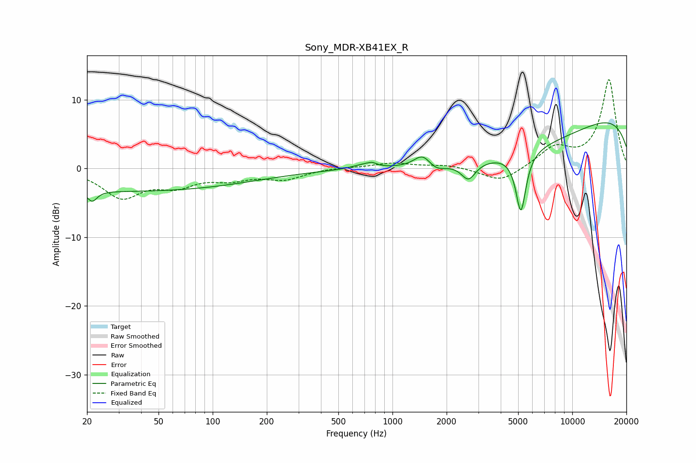

# Sony_MDR-XB41EX_R
See [usage instructions](https://github.com/jaakkopasanen/AutoEq#usage) for more options and info.

### Parametric EQs
Apply preamp of -6.7 dB when using parametric equalizer.

|   # | Type    |   Fc (Hz) |    Q |   Gain (dB) |
|-----|---------|-----------|------|-------------|
|   1 | Peaking |        21 | 5.35 |        -1.6 |
|   2 | Peaking |        33 | 0.18 |        -3.3 |
|   3 | Peaking |       682 | 2.23 |         0.6 |
|   4 | Peaking |       769 | 5.59 |         0.5 |
|   5 | Peaking |      1470 | 3.02 |         1.9 |
|   6 | Peaking |      1750 | 3.01 |        -0.9 |
|   7 | Peaking |      2646 | 3.61 |        -2.5 |
|   8 | Peaking |      5060 | 0.31 |        -5.6 |
|   9 | Peaking |      5178 | 4.92 |        -8.8 |
|  10 | Peaking |     10000 | 0.18 |         9.4 |

### Fixed Band EQs
When using fixed band (also called graphic) equalizer, apply preamp of **-13.0 dB** (if available) and set gains manually with these parameters.

|   # | Type    |   Fc (Hz) |    Q |   Gain (dB) |
|-----|---------|-----------|------|-------------|
|   1 | Peaking |        31 | 1.41 |        -4   |
|   2 | Peaking |        62 | 1.41 |        -2.2 |
|   3 | Peaking |       125 | 1.41 |        -1.3 |
|   4 | Peaking |       250 | 1.41 |        -1.4 |
|   5 | Peaking |       500 | 1.41 |         0.2 |
|   6 | Peaking |      1000 | 1.41 |         0.8 |
|   7 | Peaking |      2000 | 1.41 |         0.5 |
|   8 | Peaking |      4000 | 1.41 |        -2.1 |
|   9 | Peaking |      8000 | 1.41 |         2.8 |
|  10 | Peaking |     16000 | 1.41 |        12.9 |

### Graphs

