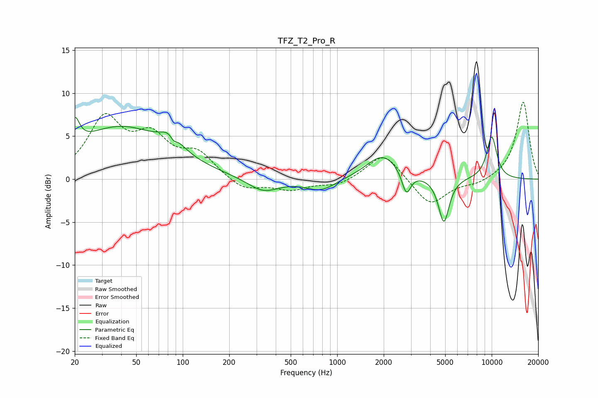

# TFZ_T2_Pro_R
See [usage instructions](https://github.com/jaakkopasanen/AutoEq#usage) for more options and info.

### Parametric EQs
Apply preamp of -7.3 dB when using parametric equalizer.

|   # | Type    |   Fc (Hz) |    Q |   Gain (dB) |
|-----|---------|-----------|------|-------------|
|   1 | Peaking |        20 | 4.8  |         3.1 |
|   2 | Peaking |        39 | 0.46 |         6   |
|   3 | Peaking |        84 | 2.27 |         2   |
|   4 | Peaking |        87 | 5.92 |        -0.9 |
|   5 | Peaking |       332 | 1.39 |        -1.6 |
|   6 | Peaking |       782 | 1.46 |        -1.4 |
|   7 | Peaking |      1974 | 1.34 |         2.9 |
|   8 | Peaking |      2803 | 4.92 |        -2.7 |
|   9 | Peaking |      4900 | 4.04 |        -5.2 |
|  10 | Peaking |     10000 | 3.59 |         5   |

### Fixed Band EQs
When using fixed band (also called graphic) equalizer, apply preamp of **-9.1 dB** (if available) and set gains manually with these parameters.

|   # | Type    |   Fc (Hz) |    Q |   Gain (dB) |
|-----|---------|-----------|------|-------------|
|   1 | Peaking |        31 | 1.41 |         6.7 |
|   2 | Peaking |        62 | 1.41 |         4.2 |
|   3 | Peaking |       125 | 1.41 |         2.7 |
|   4 | Peaking |       250 | 1.41 |        -1.4 |
|   5 | Peaking |       500 | 1.41 |        -1.2 |
|   6 | Peaking |      1000 | 1.41 |        -0.8 |
|   7 | Peaking |      2000 | 1.41 |         3.2 |
|   8 | Peaking |      4000 | 1.41 |        -3.2 |
|   9 | Peaking |      8000 | 1.41 |        -0.6 |
|  10 | Peaking |     16000 | 1.41 |         9.1 |

### Graphs

