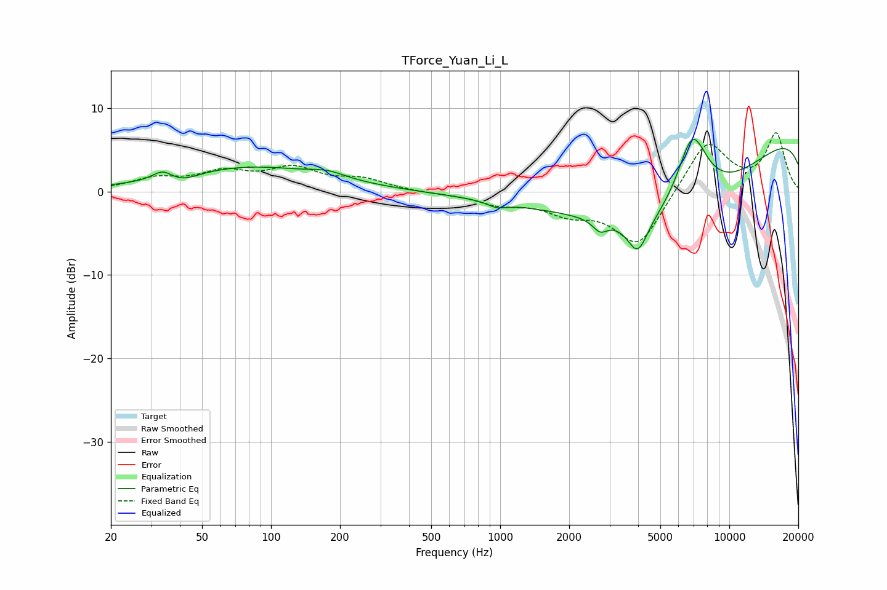

# TForce_Yuan_Li_L
See [usage instructions](https://github.com/jaakkopasanen/AutoEq#usage) for more options and info.

### Parametric EQs
Apply preamp of -6.3 dB when using parametric equalizer.

|   # | Type    |   Fc (Hz) |    Q |   Gain (dB) |
|-----|---------|-----------|------|-------------|
|   1 | Peaking |        34 | 3.34 |         1.2 |
|   2 | Peaking |        41 | 2.01 |        -0.9 |
|   3 | Peaking |        80 | 0.43 |         2.9 |
|   4 | Peaking |       177 | 1.85 |         0.7 |
|   5 | Peaking |       969 | 3.61 |        -0.6 |
|   6 | Peaking |      2727 | 4.49 |        -1.4 |
|   7 | Peaking |      3981 | 3.21 |        -4.1 |
|   8 | Peaking |      5734 | 0.32 |       -14.4 |
|   9 | Peaking |      6887 | 1.85 |         9.7 |
|  10 | Peaking |     10000 | 0.18 |        11.1 |

### Fixed Band EQs
When using fixed band (also called graphic) equalizer, apply preamp of **-7.1 dB** (if available) and set gains manually with these parameters.

|   # | Type    |   Fc (Hz) |    Q |   Gain (dB) |
|-----|---------|-----------|------|-------------|
|   1 | Peaking |        31 | 1.41 |         1.4 |
|   2 | Peaking |        62 | 1.41 |         2   |
|   3 | Peaking |       125 | 1.41 |         2.5 |
|   4 | Peaking |       250 | 1.41 |         1.3 |
|   5 | Peaking |       500 | 1.41 |        -0.2 |
|   6 | Peaking |      1000 | 1.41 |        -1.3 |
|   7 | Peaking |      2000 | 1.41 |        -2.1 |
|   8 | Peaking |      4000 | 1.41 |        -6.6 |
|   9 | Peaking |      8000 | 1.41 |         6.3 |
|  10 | Peaking |     16000 | 1.41 |         6.8 |

### Graphs

