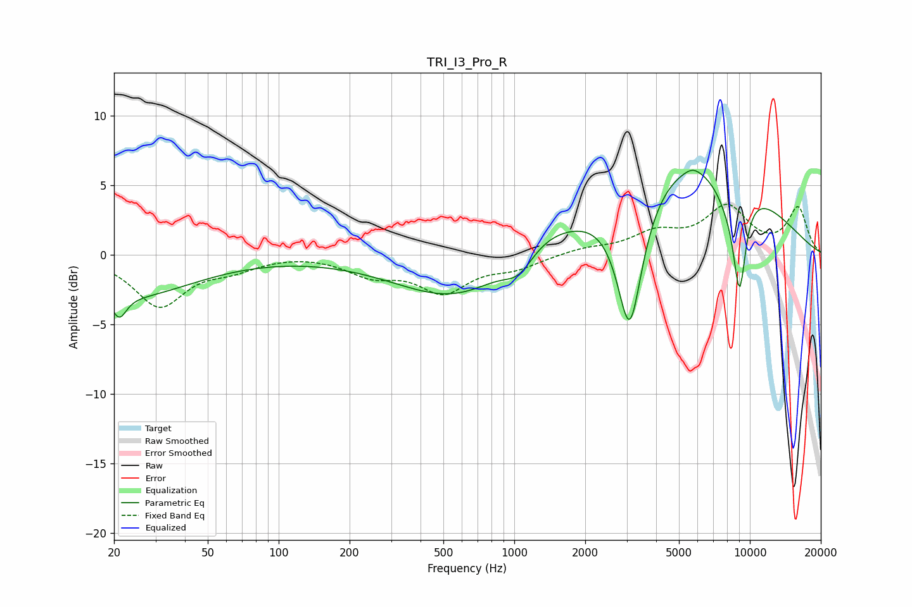

# TRI_I3_Pro_R
See [usage instructions](https://github.com/jaakkopasanen/AutoEq#usage) for more options and info.

### Parametric EQs
Apply preamp of -6.2 dB when using parametric equalizer.

|   # | Type    |   Fc (Hz) |    Q |   Gain (dB) |
|-----|---------|-----------|------|-------------|
|   1 | Peaking |        21 | 4.72 |        -1.6 |
|   2 | Peaking |        23 | 0.52 |        -2.9 |
|   3 | Peaking |       617 | 0.53 |        -3.7 |
|   4 | Peaking |      1048 | 2.03 |        -1.9 |
|   5 | Peaking |      1160 | 0.86 |         2.3 |
|   6 | Peaking |      3090 | 2.54 |       -10   |
|   7 | Peaking |      5666 | 0.39 |         7.3 |
|   8 | Peaking |      5718 | 3.83 |         0.4 |
|   9 | Peaking |      8157 | 2.02 |        -1.9 |
|  10 | Peaking |      9040 | 4.73 |        -6.6 |

### Fixed Band EQs
When using fixed band (also called graphic) equalizer, apply preamp of **-3.7 dB** (if available) and set gains manually with these parameters.

|   # | Type    |   Fc (Hz) |    Q |   Gain (dB) |
|-----|---------|-----------|------|-------------|
|   1 | Peaking |        31 | 1.41 |        -3.6 |
|   2 | Peaking |        62 | 1.41 |        -0.8 |
|   3 | Peaking |       125 | 1.41 |         0.1 |
|   4 | Peaking |       250 | 1.41 |        -1.3 |
|   5 | Peaking |       500 | 1.41 |        -2.5 |
|   6 | Peaking |      1000 | 1.41 |        -0.8 |
|   7 | Peaking |      2000 | 1.41 |         0.4 |
|   8 | Peaking |      4000 | 1.41 |         1.4 |
|   9 | Peaking |      8000 | 1.41 |         3.3 |
|  10 | Peaking |     16000 | 1.41 |         3.3 |

### Graphs

