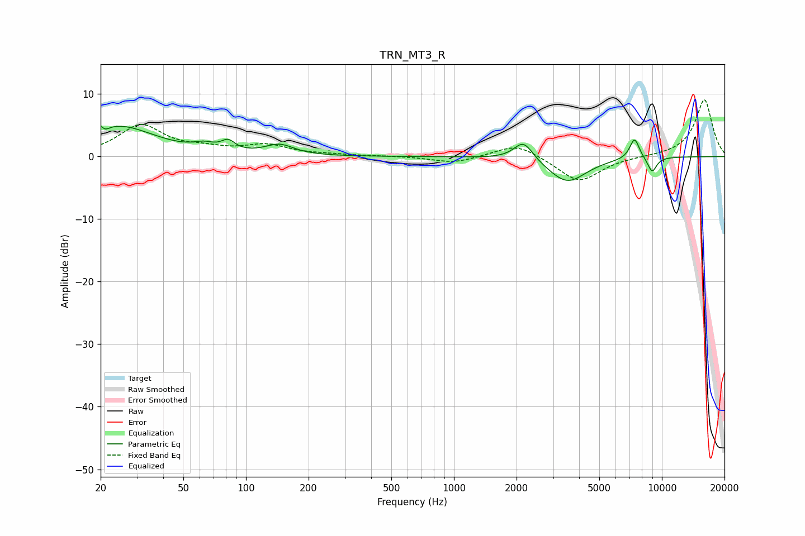

# TRN_MT3_R
See [usage instructions](https://github.com/jaakkopasanen/AutoEq#usage) for more options and info.

### Parametric EQs
Apply preamp of -5.0 dB when using parametric equalizer.

|   # | Type    |   Fc (Hz) |    Q |   Gain (dB) |
|-----|---------|-----------|------|-------------|
|   1 | Peaking |        20 | 5.72 |         2.9 |
|   2 | Peaking |        21 | 5.99 |        -2.6 |
|   3 | Peaking |        24 | 0.8  |         4.8 |
|   4 | Peaking |        63 | 2.81 |         1   |
|   5 | Peaking |        82 | 4.44 |         1.5 |
|   6 | Peaking |       145 | 2.09 |         1.7 |
|   7 | Peaking |      2160 | 3.07 |         3.1 |
|   8 | Peaking |      3507 | 1.52 |        -4.1 |
|   9 | Peaking |      7389 | 5.72 |         3.4 |
|  10 | Peaking |      8973 | 5.8  |        -2.4 |

### Fixed Band EQs
When using fixed band (also called graphic) equalizer, apply preamp of **-9.2 dB** (if available) and set gains manually with these parameters.

|   # | Type    |   Fc (Hz) |    Q |   Gain (dB) |
|-----|---------|-----------|------|-------------|
|   1 | Peaking |        31 | 1.41 |         4.9 |
|   2 | Peaking |        62 | 1.41 |         0.9 |
|   3 | Peaking |       125 | 1.41 |         1.7 |
|   4 | Peaking |       250 | 1.41 |         0.2 |
|   5 | Peaking |       500 | 1.41 |         0.1 |
|   6 | Peaking |      1000 | 1.41 |        -1.1 |
|   7 | Peaking |      2000 | 1.41 |         2.2 |
|   8 | Peaking |      4000 | 1.41 |        -4.1 |
|   9 | Peaking |      8000 | 1.41 |        -0   |
|  10 | Peaking |     16000 | 1.41 |         9.1 |

### Graphs

