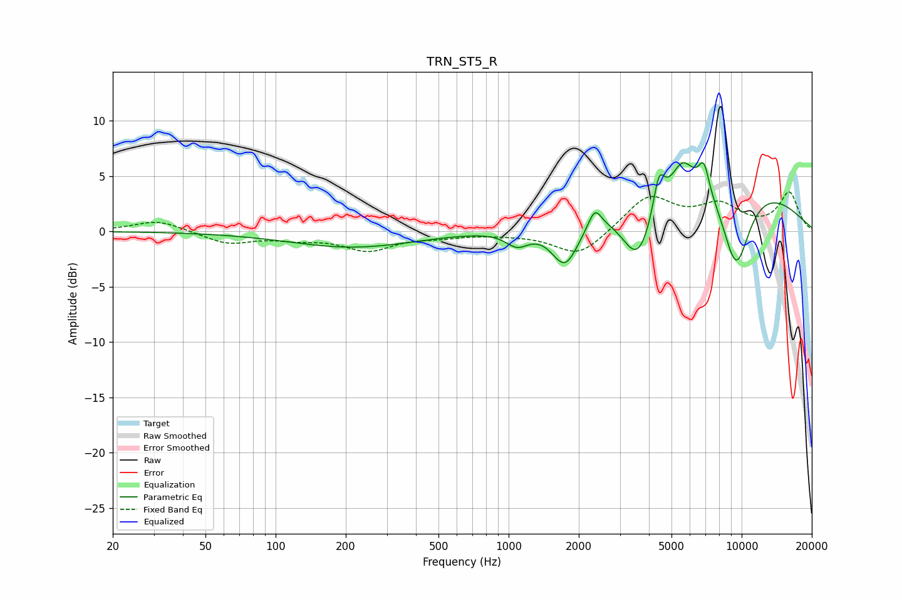

# TRN_ST5_R
See [usage instructions](https://github.com/jaakkopasanen/AutoEq#usage) for more options and info.

### Parametric EQs
Apply preamp of -6.3 dB when using parametric equalizer.

|   # | Type    |   Fc (Hz) |    Q |   Gain (dB) |
|-----|---------|-----------|------|-------------|
|   1 | Peaking |       214 | 0.52 |        -1.4 |
|   2 | Peaking |      1089 | 2.79 |        -1.4 |
|   3 | Peaking |      1748 | 2.4  |        -4.1 |
|   4 | Peaking |      2344 | 5.18 |         1.7 |
|   5 | Peaking |      3597 | 1.95 |        -6   |
|   6 | Peaking |      4415 | 5.85 |         3.3 |
|   7 | Peaking |      5567 | 2.94 |         2.7 |
|   8 | Peaking |      6882 | 5.83 |         2.6 |
|   9 | Peaking |      7298 | 0.31 |         5.5 |
|  10 | Peaking |      9453 | 1.95 |        -7.9 |

### Fixed Band EQs
When using fixed band (also called graphic) equalizer, apply preamp of **-3.7 dB** (if available) and set gains manually with these parameters.

|   # | Type    |   Fc (Hz) |    Q |   Gain (dB) |
|-----|---------|-----------|------|-------------|
|   1 | Peaking |        31 | 1.41 |         1   |
|   2 | Peaking |        62 | 1.41 |        -1.1 |
|   3 | Peaking |       125 | 1.41 |        -0.5 |
|   4 | Peaking |       250 | 1.41 |        -1.6 |
|   5 | Peaking |       500 | 1.41 |        -0.4 |
|   6 | Peaking |      1000 | 1.41 |        -0.1 |
|   7 | Peaking |      2000 | 1.41 |        -2.3 |
|   8 | Peaking |      4000 | 1.41 |         3.2 |
|   9 | Peaking |      8000 | 1.41 |         2.2 |
|  10 | Peaking |     16000 | 1.41 |         3.4 |

### Graphs

