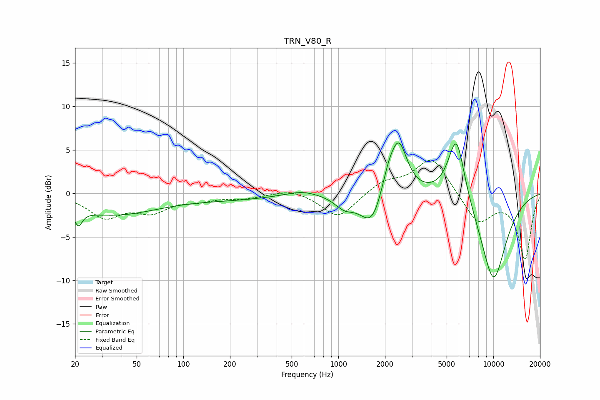

# TRN_V80_R
See [usage instructions](https://github.com/jaakkopasanen/AutoEq#usage) for more options and info.

### Parametric EQs
Apply preamp of -5.9 dB when using parametric equalizer.

|   # | Type    |   Fc (Hz) |    Q |   Gain (dB) |
|-----|---------|-----------|------|-------------|
|   1 | Peaking |        21 | 5.67 |        -1.8 |
|   2 | Peaking |        35 | 0.47 |        -2.4 |
|   3 | Peaking |       215 | 0.5  |        -0.6 |
|   4 | Peaking |       585 | 1.33 |         0.6 |
|   5 | Peaking |      1095 | 2.24 |        -1.3 |
|   6 | Peaking |      1652 | 1.89 |        -4   |
|   7 | Peaking |      2100 | 3.07 |         2.3 |
|   8 | Peaking |      2456 | 2.56 |         5.9 |
|   9 | Peaking |      5781 | 2.48 |         7.7 |
|  10 | Peaking |     10000 | 1.36 |       -10.2 |

### Fixed Band EQs
When using fixed band (also called graphic) equalizer, apply preamp of **-3.9 dB** (if available) and set gains manually with these parameters.

|   # | Type    |   Fc (Hz) |    Q |   Gain (dB) |
|-----|---------|-----------|------|-------------|
|   1 | Peaking |        31 | 1.41 |        -2.6 |
|   2 | Peaking |        62 | 1.41 |        -1.9 |
|   3 | Peaking |       125 | 1.41 |        -0.6 |
|   4 | Peaking |       250 | 1.41 |        -0.5 |
|   5 | Peaking |       500 | 1.41 |         0.6 |
|   6 | Peaking |      1000 | 1.41 |        -2.9 |
|   7 | Peaking |      2000 | 1.41 |         1.3 |
|   8 | Peaking |      4000 | 1.41 |         4.2 |
|   9 | Peaking |      8000 | 1.41 |        -3.4 |
|  10 | Peaking |     16000 | 1.41 |        -7.5 |

### Graphs

