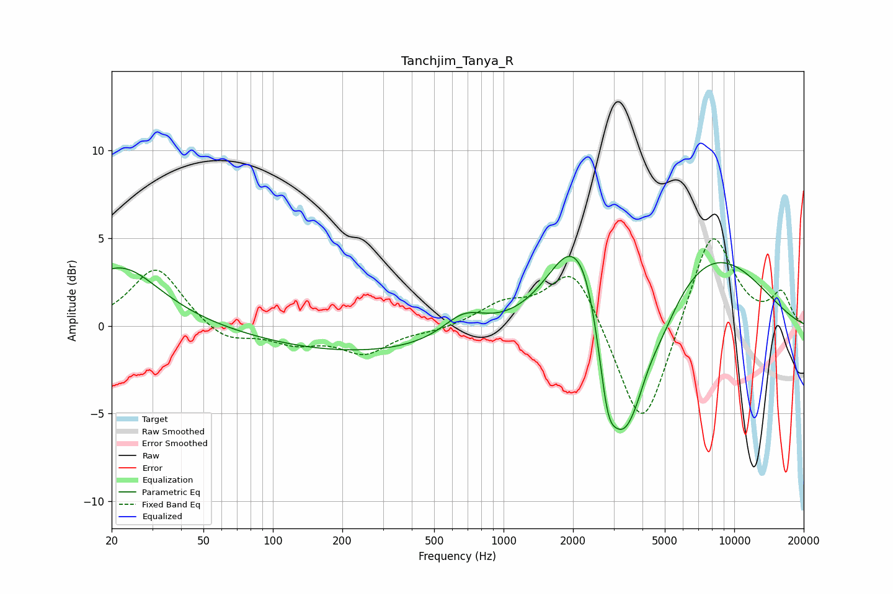

# Tanchjim_Tanya_R
See [usage instructions](https://github.com/jaakkopasanen/AutoEq#usage) for more options and info.

### Parametric EQs
Apply preamp of -4.1 dB when using parametric equalizer.

|   # | Type    |   Fc (Hz) |    Q |   Gain (dB) |
|-----|---------|-----------|------|-------------|
|   1 | Peaking |        22 | 0.84 |         3.4 |
|   2 | Peaking |       256 | 0.3  |        -1.5 |
|   3 | Peaking |       673 | 1.52 |         1.3 |
|   4 | Peaking |      1987 | 1.25 |         4.7 |
|   5 | Peaking |      2291 | 2.42 |         1.2 |
|   6 | Peaking |      2822 | 3.79 |        -3.5 |
|   7 | Peaking |      3307 | 1.77 |        -7.1 |
|   8 | Peaking |      3797 | 3.37 |        -0.6 |
|   9 | Peaking |      4783 | 1.6  |        -1.7 |
|  10 | Peaking |      7871 | 0.53 |         4.2 |

### Fixed Band EQs
When using fixed band (also called graphic) equalizer, apply preamp of **-5.1 dB** (if available) and set gains manually with these parameters.

|   # | Type    |   Fc (Hz) |    Q |   Gain (dB) |
|-----|---------|-----------|------|-------------|
|   1 | Peaking |        31 | 1.41 |         3.4 |
|   2 | Peaking |        62 | 1.41 |        -1   |
|   3 | Peaking |       125 | 1.41 |        -0.9 |
|   4 | Peaking |       250 | 1.41 |        -1.5 |
|   5 | Peaking |       500 | 1.41 |        -0.2 |
|   6 | Peaking |      1000 | 1.41 |         1.1 |
|   7 | Peaking |      2000 | 1.41 |         3.6 |
|   8 | Peaking |      4000 | 1.41 |        -6.5 |
|   9 | Peaking |      8000 | 1.41 |         5.7 |
|  10 | Peaking |     16000 | 1.41 |         1.8 |

### Graphs

