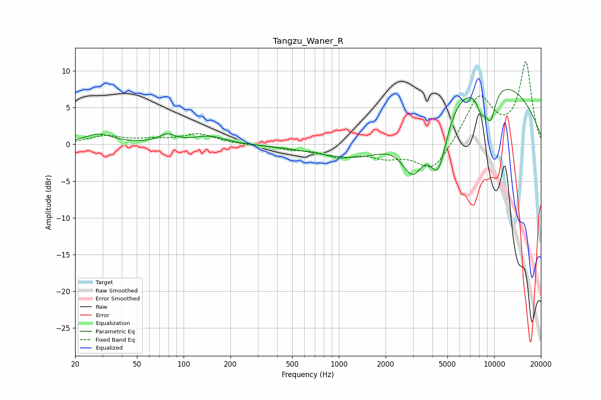

# Tangzu_Waner_R
See [usage instructions](https://github.com/jaakkopasanen/AutoEq#usage) for more options and info.

### Parametric EQs
Apply preamp of -7.6 dB when using parametric equalizer.

|   # | Type    |   Fc (Hz) |    Q |   Gain (dB) |
|-----|---------|-----------|------|-------------|
|   1 | Peaking |        28 | 1.57 |         1.3 |
|   2 | Peaking |        78 | 2.66 |         1.1 |
|   3 | Peaking |       146 | 1.38 |         1.1 |
|   4 | Peaking |      1523 | 0.55 |        -4.2 |
|   5 | Peaking |      3002 | 1.81 |        -6.8 |
|   6 | Peaking |      4326 | 2.43 |        -6.9 |
|   7 | Peaking |      4575 | 2.66 |        -1.4 |
|   8 | Peaking |      7595 | 0.24 |         9.7 |
|   9 | Peaking |      8252 | 4.2  |        -2.7 |
|  10 | Peaking |      9470 | 3.54 |        -4.6 |

### Fixed Band EQs
When using fixed band (also called graphic) equalizer, apply preamp of **-11.3 dB** (if available) and set gains manually with these parameters.

|   # | Type    |   Fc (Hz) |    Q |   Gain (dB) |
|-----|---------|-----------|------|-------------|
|   1 | Peaking |        31 | 1.41 |         1.1 |
|   2 | Peaking |        62 | 1.41 |         0.5 |
|   3 | Peaking |       125 | 1.41 |         1.4 |
|   4 | Peaking |       250 | 1.41 |        -0.1 |
|   5 | Peaking |       500 | 1.41 |        -0.5 |
|   6 | Peaking |      1000 | 1.41 |        -1.5 |
|   7 | Peaking |      2000 | 1.41 |        -1.4 |
|   8 | Peaking |      4000 | 1.41 |        -3.8 |
|   9 | Peaking |      8000 | 1.41 |         6.5 |
|  10 | Peaking |     16000 | 1.41 |        11   |

### Graphs

