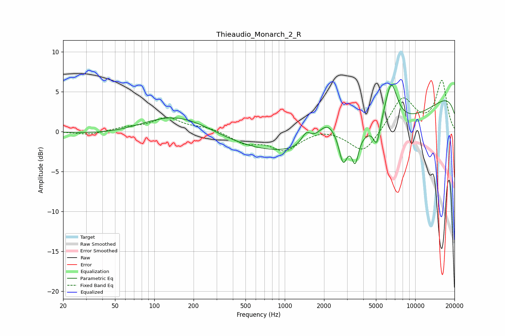

# Thieaudio_Monarch_2_R
See [usage instructions](https://github.com/jaakkopasanen/AutoEq#usage) for more options and info.

### Parametric EQs
Apply preamp of -5.9 dB when using parametric equalizer.

|   # | Type    |   Fc (Hz) |    Q |   Gain (dB) |
|-----|---------|-----------|------|-------------|
|   1 | Peaking |       146 | 0.46 |         4.5 |
|   2 | Peaking |       244 | 0.18 |        -2.9 |
|   3 | Peaking |      1459 | 3.89 |         1.5 |
|   4 | Peaking |      2129 | 1.85 |         2.8 |
|   5 | Peaking |      2801 | 4.72 |        -3.5 |
|   6 | Peaking |      3466 | 5.66 |        -3.2 |
|   7 | Peaking |      5074 | 5.69 |        -2.7 |
|   8 | Peaking |      5530 | 0.24 |        -6.7 |
|   9 | Peaking |      6531 | 2.85 |         5.5 |
|  10 | Peaking |     10000 | 0.18 |         7.6 |

### Fixed Band EQs
When using fixed band (also called graphic) equalizer, apply preamp of **-6.5 dB** (if available) and set gains manually with these parameters.

|   # | Type    |   Fc (Hz) |    Q |   Gain (dB) |
|-----|---------|-----------|------|-------------|
|   1 | Peaking |        31 | 1.41 |        -0.4 |
|   2 | Peaking |        62 | 1.41 |         0.5 |
|   3 | Peaking |       125 | 1.41 |         1.7 |
|   4 | Peaking |       250 | 1.41 |         0.5 |
|   5 | Peaking |       500 | 1.41 |        -1.4 |
|   6 | Peaking |      1000 | 1.41 |        -2.2 |
|   7 | Peaking |      2000 | 1.41 |         0.5 |
|   8 | Peaking |      4000 | 1.41 |        -2.8 |
|   9 | Peaking |      8000 | 1.41 |         4.3 |
|  10 | Peaking |     16000 | 1.41 |         6.3 |

### Graphs

