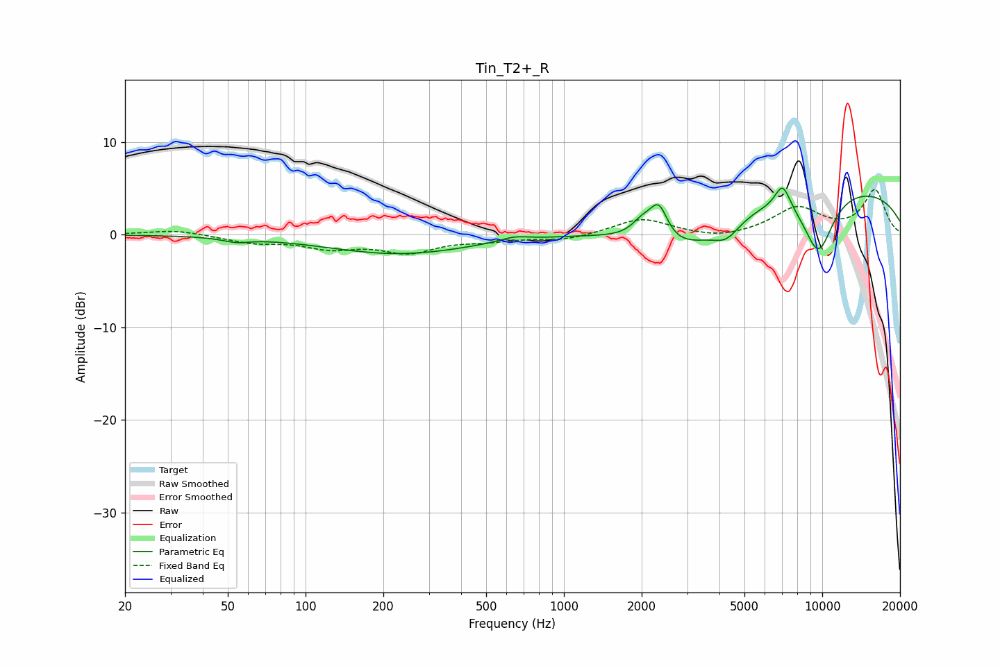

# Tin_T2+_R
See [usage instructions](https://github.com/jaakkopasanen/AutoEq#usage) for more options and info.

### Parametric EQs
Apply preamp of -5.1 dB when using parametric equalizer.

|   # | Type    |   Fc (Hz) |    Q |   Gain (dB) |
|-----|---------|-----------|------|-------------|
|   1 | Peaking |        54 | 2.77 |        -0.5 |
|   2 | Peaking |       230 | 0.51 |        -2.1 |
|   3 | Peaking |       641 | 2.49 |         0.5 |
|   4 | Peaking |      2015 | 3.33 |         1.7 |
|   5 | Peaking |      2331 | 4.06 |         3.7 |
|   6 | Peaking |      2857 | 0.85 |        -4.1 |
|   7 | Peaking |      4255 | 2.57 |        -1.9 |
|   8 | Peaking |      7023 | 4.55 |         2.7 |
|   9 | Peaking |      9656 | 2.07 |        -6.6 |
|  10 | Peaking |     10000 | 0.21 |         5.3 |

### Fixed Band EQs
When using fixed band (also called graphic) equalizer, apply preamp of **-5.0 dB** (if available) and set gains manually with these parameters.

|   # | Type    |   Fc (Hz) |    Q |   Gain (dB) |
|-----|---------|-----------|------|-------------|
|   1 | Peaking |        31 | 1.41 |         0.5 |
|   2 | Peaking |        62 | 1.41 |        -0.8 |
|   3 | Peaking |       125 | 1.41 |        -1.3 |
|   4 | Peaking |       250 | 1.41 |        -1.7 |
|   5 | Peaking |       500 | 1.41 |        -0.5 |
|   6 | Peaking |      1000 | 1.41 |        -0.6 |
|   7 | Peaking |      2000 | 1.41 |         1.8 |
|   8 | Peaking |      4000 | 1.41 |        -0.6 |
|   9 | Peaking |      8000 | 1.41 |         2.8 |
|  10 | Peaking |     16000 | 1.41 |         4.7 |

### Graphs

