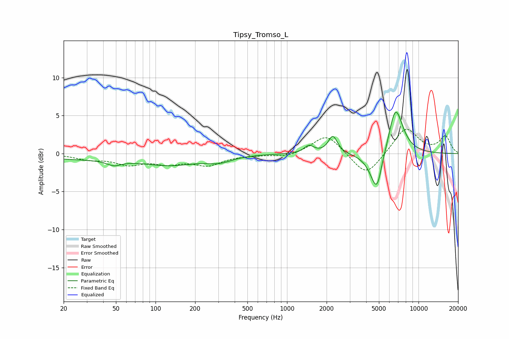

# Tipsy_Tromso_L
See [usage instructions](https://github.com/jaakkopasanen/AutoEq#usage) for more options and info.

### Parametric EQs
Apply preamp of -5.5 dB when using parametric equalizer.

|   # | Type    |   Fc (Hz) |    Q |   Gain (dB) |
|-----|---------|-----------|------|-------------|
|   1 | Peaking |        26 | 0.34 |        -0.7 |
|   2 | Peaking |        48 | 2.62 |        -0.7 |
|   3 | Peaking |       131 | 0.66 |        -1.3 |
|   4 | Peaking |       304 | 1.46 |        -0.6 |
|   5 | Peaking |       313 | 1.85 |        -0.1 |
|   6 | Peaking |      1471 | 3.81 |         1   |
|   7 | Peaking |      2231 | 4.09 |         2.3 |
|   8 | Peaking |      4901 | 2.67 |        -6.7 |
|   9 | Peaking |      5241 | 4.63 |         1.4 |
|  10 | Peaking |      6662 | 2.34 |         6.7 |

### Fixed Band EQs
When using fixed band (also called graphic) equalizer, apply preamp of **-3.3 dB** (if available) and set gains manually with these parameters.

|   # | Type    |   Fc (Hz) |    Q |   Gain (dB) |
|-----|---------|-----------|------|-------------|
|   1 | Peaking |        31 | 1.41 |        -0.7 |
|   2 | Peaking |        62 | 1.41 |        -1.3 |
|   3 | Peaking |       125 | 1.41 |        -1.1 |
|   4 | Peaking |       250 | 1.41 |        -1.4 |
|   5 | Peaking |       500 | 1.41 |        -0.1 |
|   6 | Peaking |      1000 | 1.41 |        -0.5 |
|   7 | Peaking |      2000 | 1.41 |         2.6 |
|   8 | Peaking |      4000 | 1.41 |        -3.1 |
|   9 | Peaking |      8000 | 1.41 |         3.5 |
|  10 | Peaking |     16000 | 1.41 |         2.2 |

### Graphs

