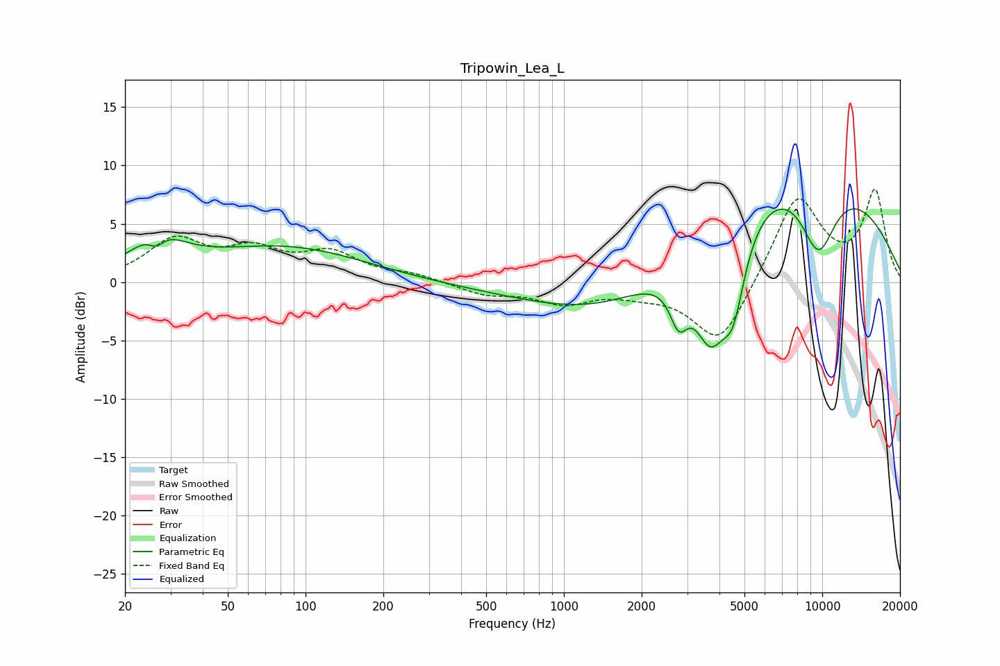

# Tripowin_Lea_L
See [usage instructions](https://github.com/jaakkopasanen/AutoEq#usage) for more options and info.

### Parametric EQs
Apply preamp of -6.4 dB when using parametric equalizer.

|   # | Type    |   Fc (Hz) |    Q |   Gain (dB) |
|-----|---------|-----------|------|-------------|
|   1 | Peaking |        26 | 4.53 |        -1.2 |
|   2 | Peaking |        27 | 1.46 |         3.1 |
|   3 | Peaking |        86 | 0.44 |         3.2 |
|   4 | Peaking |       227 | 0.32 |        -0.4 |
|   5 | Peaking |      1616 | 0.47 |        -4.4 |
|   6 | Peaking |      2781 | 4.05 |        -3.4 |
|   7 | Peaking |      3700 | 1.97 |        -8.7 |
|   8 | Peaking |      4527 | 3.03 |        -5.8 |
|   9 | Peaking |      7474 | 0.29 |        11   |
|  10 | Peaking |      9651 | 1.68 |        -6.8 |

### Fixed Band EQs
When using fixed band (also called graphic) equalizer, apply preamp of **-8.1 dB** (if available) and set gains manually with these parameters.

|   # | Type    |   Fc (Hz) |    Q |   Gain (dB) |
|-----|---------|-----------|------|-------------|
|   1 | Peaking |        31 | 1.41 |         3.4 |
|   2 | Peaking |        62 | 1.41 |         2.3 |
|   3 | Peaking |       125 | 1.41 |         2.3 |
|   4 | Peaking |       250 | 1.41 |         0.6 |
|   5 | Peaking |       500 | 1.41 |        -1   |
|   6 | Peaking |      1000 | 1.41 |        -1.6 |
|   7 | Peaking |      2000 | 1.41 |        -0.7 |
|   8 | Peaking |      4000 | 1.41 |        -5.5 |
|   9 | Peaking |      8000 | 1.41 |         7.5 |
|  10 | Peaking |     16000 | 1.41 |         7.6 |

### Graphs

