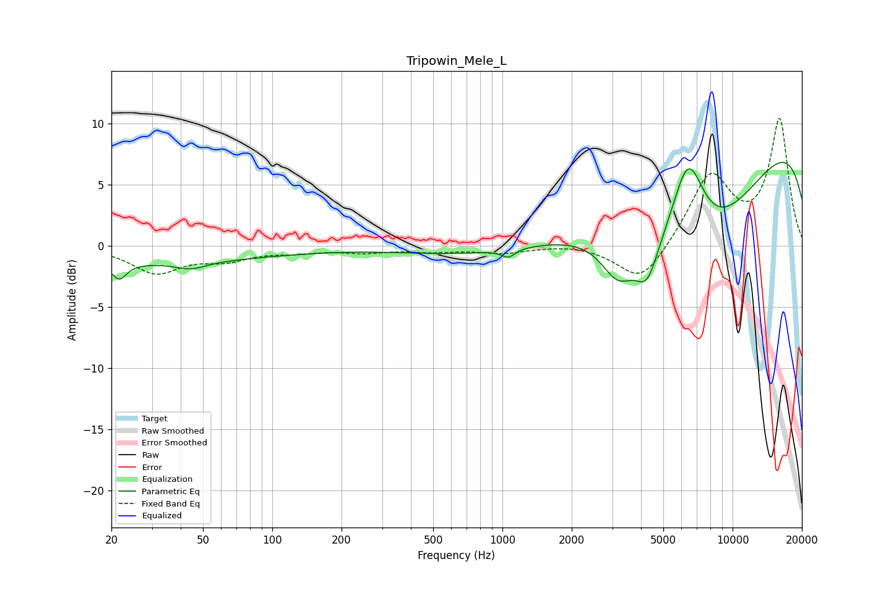

# Tripowin_Mele_L
See [usage instructions](https://github.com/jaakkopasanen/AutoEq#usage) for more options and info.

### Parametric EQs
Apply preamp of -6.9 dB when using parametric equalizer.

|   # | Type    |   Fc (Hz) |    Q |   Gain (dB) |
|-----|---------|-----------|------|-------------|
|   1 | Peaking |        20 | 0.18 |        -1.4 |
|   2 | Peaking |        22 | 4.65 |        -1.3 |
|   3 | Peaking |        44 | 2.17 |        -0.6 |
|   4 | Peaking |      1060 | 4.99 |        -0.7 |
|   5 | Peaking |      2597 | 0.18 |        -1.8 |
|   6 | Peaking |      3181 | 1.93 |        -3.3 |
|   7 | Peaking |      4248 | 2.82 |        -3.3 |
|   8 | Peaking |      6407 | 1.86 |         7.4 |
|   9 | Peaking |      7043 | 0.44 |       -10.1 |
|  10 | Peaking |     10000 | 0.18 |        11.8 |

### Fixed Band EQs
When using fixed band (also called graphic) equalizer, apply preamp of **-10.5 dB** (if available) and set gains manually with these parameters.

|   # | Type    |   Fc (Hz) |    Q |   Gain (dB) |
|-----|---------|-----------|------|-------------|
|   1 | Peaking |        31 | 1.41 |        -2.1 |
|   2 | Peaking |        62 | 1.41 |        -1   |
|   3 | Peaking |       125 | 1.41 |        -0.4 |
|   4 | Peaking |       250 | 1.41 |        -0.4 |
|   5 | Peaking |       500 | 1.41 |        -0.4 |
|   6 | Peaking |      1000 | 1.41 |        -0.5 |
|   7 | Peaking |      2000 | 1.41 |         0.2 |
|   8 | Peaking |      4000 | 1.41 |        -3.2 |
|   9 | Peaking |      8000 | 1.41 |         5.8 |
|  10 | Peaking |     16000 | 1.41 |        10.2 |

### Graphs

