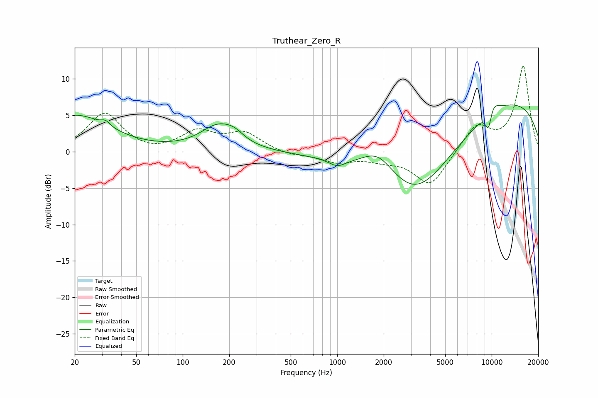

# Truthear_Zero_R
See [usage instructions](https://github.com/jaakkopasanen/AutoEq#usage) for more options and info.

### Parametric EQs
Apply preamp of -6.5 dB when using parametric equalizer.

|   # | Type    |   Fc (Hz) |    Q |   Gain (dB) |
|-----|---------|-----------|------|-------------|
|   1 | Peaking |        20 | 0.65 |         4.9 |
|   2 | Peaking |        32 | 5.34 |         0.7 |
|   3 | Peaking |       171 | 1.22 |         3.4 |
|   4 | Peaking |       217 | 2.49 |         0.8 |
|   5 | Peaking |      1000 | 2.75 |        -0.9 |
|   6 | Peaking |      1836 | 1.29 |         3.3 |
|   7 | Peaking |      3249 | 0.49 |       -12.5 |
|   8 | Peaking |      8355 | 0.18 |         8.7 |
|   9 | Peaking |      9562 | 4.65 |        -5.4 |
|  10 | Peaking |      9757 | 3.01 |         4.2 |

### Fixed Band EQs
When using fixed band (also called graphic) equalizer, apply preamp of **-11.9 dB** (if available) and set gains manually with these parameters.

|   # | Type    |   Fc (Hz) |    Q |   Gain (dB) |
|-----|---------|-----------|------|-------------|
|   1 | Peaking |        31 | 1.41 |         5.3 |
|   2 | Peaking |        62 | 1.41 |        -0.4 |
|   3 | Peaking |       125 | 1.41 |         2.6 |
|   4 | Peaking |       250 | 1.41 |         2.4 |
|   5 | Peaking |       500 | 1.41 |        -0.5 |
|   6 | Peaking |      1000 | 1.41 |        -1.3 |
|   7 | Peaking |      2000 | 1.41 |        -0.9 |
|   8 | Peaking |      4000 | 1.41 |        -4.7 |
|   9 | Peaking |      8000 | 1.41 |         3.6 |
|  10 | Peaking |     16000 | 1.41 |        11.7 |

### Graphs

