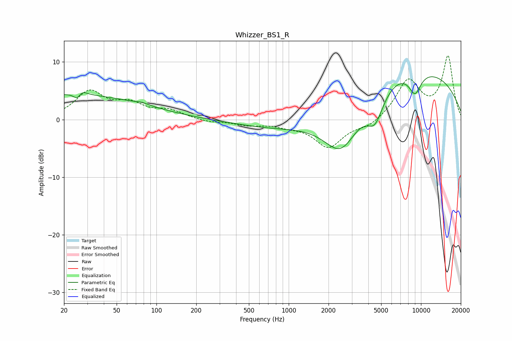

# Whizzer_BS1_R
See [usage instructions](https://github.com/jaakkopasanen/AutoEq#usage) for more options and info.

### Parametric EQs
Apply preamp of -7.5 dB when using parametric equalizer.

|   # | Type    |   Fc (Hz) |    Q |   Gain (dB) |
|-----|---------|-----------|------|-------------|
|   1 | Peaking |        20 | 0.21 |         4.3 |
|   2 | Peaking |        25 | 4.79 |        -2.3 |
|   3 | Peaking |        26 | 3.93 |         2.1 |
|   4 | Peaking |        78 | 3.13 |         0.3 |
|   5 | Peaking |      1054 | 0.43 |        -3.4 |
|   6 | Peaking |      2317 | 0.29 |         2.7 |
|   7 | Peaking |      2502 | 0.84 |       -11.6 |
|   8 | Peaking |      4496 | 2.12 |        -5.3 |
|   9 | Peaking |      7281 | 0.2  |         9   |
|  10 | Peaking |      9009 | 2.7  |        -3.7 |

### Fixed Band EQs
When using fixed band (also called graphic) equalizer, apply preamp of **-11.2 dB** (if available) and set gains manually with these parameters.

|   # | Type    |   Fc (Hz) |    Q |   Gain (dB) |
|-----|---------|-----------|------|-------------|
|   1 | Peaking |        31 | 1.41 |         4.7 |
|   2 | Peaking |        62 | 1.41 |         2.3 |
|   3 | Peaking |       125 | 1.41 |         1.4 |
|   4 | Peaking |       250 | 1.41 |        -0.5 |
|   5 | Peaking |       500 | 1.41 |        -0.8 |
|   6 | Peaking |      1000 | 1.41 |        -0.8 |
|   7 | Peaking |      2000 | 1.41 |        -4.7 |
|   8 | Peaking |      4000 | 1.41 |        -1.2 |
|   9 | Peaking |      8000 | 1.41 |         6.7 |
|  10 | Peaking |     16000 | 1.41 |        10.8 |

### Graphs

