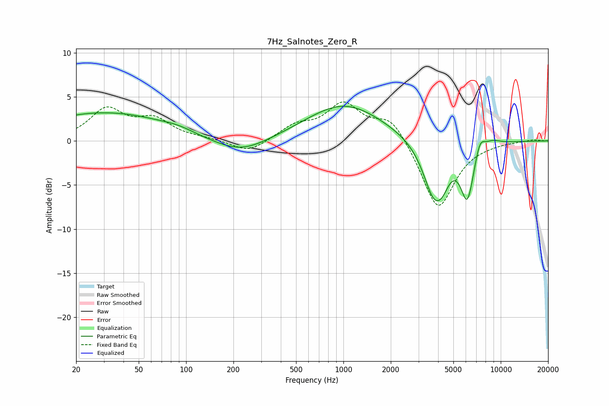

# 7Hz_Salnotes_Zero_R
See [usage instructions](https://github.com/jaakkopasanen/AutoEq#usage) for more options and info.

### Parametric EQs
Apply preamp of -4.0 dB when using parametric equalizer.

|   # | Type    |   Fc (Hz) |    Q |   Gain (dB) |
|-----|---------|-----------|------|-------------|
|   1 | Peaking |        20 | 0.45 |         2.1 |
|   2 | Peaking |        50 | 0.49 |         1.7 |
|   3 | Peaking |        89 | 1.45 |         0.4 |
|   4 | Peaking |       223 | 0.82 |        -1.7 |
|   5 | Peaking |      1013 | 0.58 |         4.2 |
|   6 | Peaking |      3774 | 1.96 |        -6.2 |
|   7 | Peaking |      4290 | 3.38 |        -1.3 |
|   8 | Peaking |      6137 | 3.19 |        -6.1 |
|   9 | Peaking |      7366 | 4.18 |         1.9 |
|  10 | Peaking |      8829 | 2.44 |         0.6 |

### Fixed Band EQs
When using fixed band (also called graphic) equalizer, apply preamp of **-4.5 dB** (if available) and set gains manually with these parameters.

|   # | Type    |   Fc (Hz) |    Q |   Gain (dB) |
|-----|---------|-----------|------|-------------|
|   1 | Peaking |        31 | 1.41 |         3.4 |
|   2 | Peaking |        62 | 1.41 |         2.2 |
|   3 | Peaking |       125 | 1.41 |         0.2 |
|   4 | Peaking |       250 | 1.41 |        -1.4 |
|   5 | Peaking |       500 | 1.41 |         1.6 |
|   6 | Peaking |      1000 | 1.41 |         4   |
|   7 | Peaking |      2000 | 1.41 |         2.8 |
|   8 | Peaking |      4000 | 1.41 |        -7.9 |
|   9 | Peaking |      8000 | 1.41 |        -0.1 |
|  10 | Peaking |     16000 | 1.41 |         0.2 |

### Graphs

