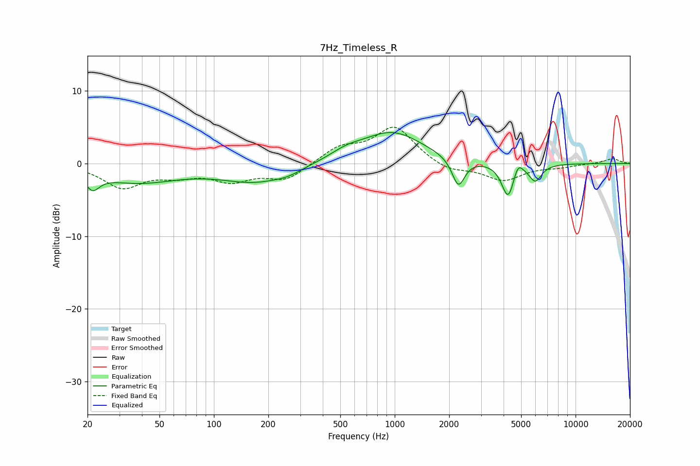

# 7Hz_Timeless_R
See [usage instructions](https://github.com/jaakkopasanen/AutoEq#usage) for more options and info.

### Parametric EQs
Apply preamp of -4.4 dB when using parametric equalizer.

|   # | Type    |   Fc (Hz) |    Q |   Gain (dB) |
|-----|---------|-----------|------|-------------|
|   1 | Peaking |        21 | 3.77 |        -2.1 |
|   2 | Peaking |        38 | 0.62 |        -2.4 |
|   3 | Peaking |       171 | 0.73 |        -2.4 |
|   4 | Peaking |       257 | 1.99 |        -0.5 |
|   5 | Peaking |       538 | 1.55 |         1   |
|   6 | Peaking |       967 | 0.82 |         4.3 |
|   7 | Peaking |      2250 | 4.06 |        -3.9 |
|   8 | Peaking |      4236 | 4.06 |        -4.8 |
|   9 | Peaking |      4804 | 5.64 |         1.7 |
|  10 | Peaking |      5992 | 4.02 |        -2.3 |

### Fixed Band EQs
When using fixed band (also called graphic) equalizer, apply preamp of **-5.1 dB** (if available) and set gains manually with these parameters.

|   # | Type    |   Fc (Hz) |    Q |   Gain (dB) |
|-----|---------|-----------|------|-------------|
|   1 | Peaking |        31 | 1.41 |        -3.2 |
|   2 | Peaking |        62 | 1.41 |        -1.3 |
|   3 | Peaking |       125 | 1.41 |        -2.1 |
|   4 | Peaking |       250 | 1.41 |        -2.2 |
|   5 | Peaking |       500 | 1.41 |         2.1 |
|   6 | Peaking |      1000 | 1.41 |         5   |
|   7 | Peaking |      2000 | 1.41 |        -1.2 |
|   8 | Peaking |      4000 | 1.41 |        -2.3 |
|   9 | Peaking |      8000 | 1.41 |        -0.4 |
|  10 | Peaking |     16000 | 1.41 |         0.7 |

### Graphs

