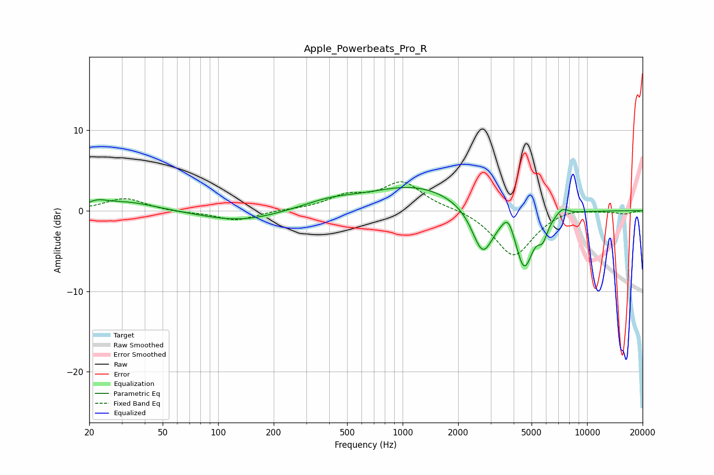

# Apple_Powerbeats_Pro_R
See [usage instructions](https://github.com/jaakkopasanen/AutoEq#usage) for more options and info.

### Parametric EQs
Apply preamp of -3.0 dB when using parametric equalizer.

|   # | Type    |   Fc (Hz) |    Q |   Gain (dB) |
|-----|---------|-----------|------|-------------|
|   1 | Peaking |        22 | 2.71 |         0.7 |
|   2 | Peaking |        32 | 0.9  |         1.1 |
|   3 | Peaking |       131 | 0.69 |        -1.3 |
|   4 | Peaking |       402 | 0.95 |         1   |
|   5 | Peaking |      1180 | 0.56 |         3   |
|   6 | Peaking |      2715 | 2.44 |        -5.8 |
|   7 | Peaking |      3735 | 4.27 |         2.1 |
|   8 | Peaking |      4558 | 2.91 |        -7   |
|   9 | Peaking |      5758 | 5.27 |        -2.1 |
|  10 | Peaking |      7338 | 4.22 |         0.9 |

### Fixed Band EQs
When using fixed band (also called graphic) equalizer, apply preamp of **-3.7 dB** (if available) and set gains manually with these parameters.

|   # | Type    |   Fc (Hz) |    Q |   Gain (dB) |
|-----|---------|-----------|------|-------------|
|   1 | Peaking |        31 | 1.41 |         1.6 |
|   2 | Peaking |        62 | 1.41 |        -0.2 |
|   3 | Peaking |       125 | 1.41 |        -1.2 |
|   4 | Peaking |       250 | 1.41 |         0.1 |
|   5 | Peaking |       500 | 1.41 |         1.6 |
|   6 | Peaking |      1000 | 1.41 |         3.4 |
|   7 | Peaking |      2000 | 1.41 |         0.3 |
|   8 | Peaking |      4000 | 1.41 |        -5.7 |
|   9 | Peaking |      8000 | 1.41 |         0.5 |
|  10 | Peaking |     16000 | 1.41 |        -0.4 |

### Graphs

