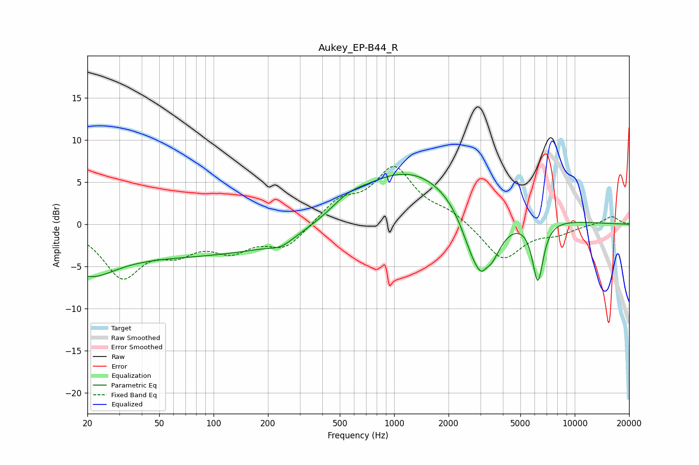

# Aukey_EP-B44_R
See [usage instructions](https://github.com/jaakkopasanen/AutoEq#usage) for more options and info.

### Parametric EQs
Apply preamp of -6.0 dB when using parametric equalizer.

|   # | Type    |   Fc (Hz) |    Q |   Gain (dB) |
|-----|---------|-----------|------|-------------|
|   1 | Peaking |        20 | 0.99 |        -3.7 |
|   2 | Peaking |        80 | 0.18 |        -3.7 |
|   3 | Peaking |       237 | 2.21 |        -0.8 |
|   4 | Peaking |       552 | 1.5  |         1.2 |
|   5 | Peaking |      1178 | 0.49 |         5.8 |
|   6 | Peaking |      2180 | 0.23 |         1.1 |
|   7 | Peaking |      2671 | 2.1  |        -2.8 |
|   8 | Peaking |      3198 | 2.07 |        -8.1 |
|   9 | Peaking |      3253 | 6    |         1.3 |
|  10 | Peaking |      6248 | 4.46 |        -7.3 |

### Fixed Band EQs
When using fixed band (also called graphic) equalizer, apply preamp of **-6.9 dB** (if available) and set gains manually with these parameters.

|   # | Type    |   Fc (Hz) |    Q |   Gain (dB) |
|-----|---------|-----------|------|-------------|
|   1 | Peaking |        31 | 1.41 |        -5.9 |
|   2 | Peaking |        62 | 1.41 |        -2.6 |
|   3 | Peaking |       125 | 1.41 |        -2.7 |
|   4 | Peaking |       250 | 1.41 |        -2.7 |
|   5 | Peaking |       500 | 1.41 |         2.6 |
|   6 | Peaking |      1000 | 1.41 |         6.4 |
|   7 | Peaking |      2000 | 1.41 |         1.2 |
|   8 | Peaking |      4000 | 1.41 |        -4.3 |
|   9 | Peaking |      8000 | 1.41 |        -0.9 |
|  10 | Peaking |     16000 | 1.41 |         1   |

### Graphs

