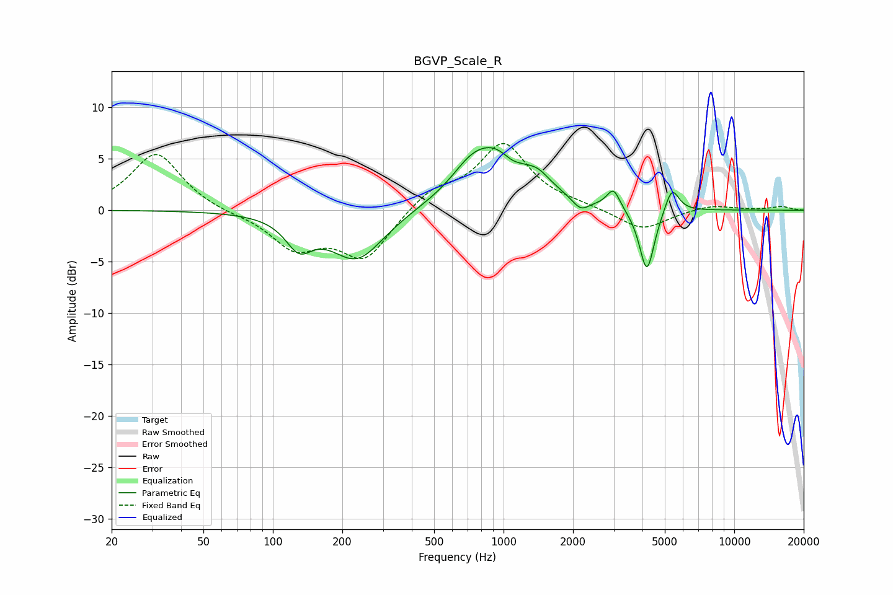

# BGVP_Scale_R
See [usage instructions](https://github.com/jaakkopasanen/AutoEq#usage) for more options and info.

### Parametric EQs
Apply preamp of -6.2 dB when using parametric equalizer.

|   # | Type    |   Fc (Hz) |    Q |   Gain (dB) |
|-----|---------|-----------|------|-------------|
|   1 | Peaking |       130 | 2.46 |        -2.8 |
|   2 | Peaking |       231 | 1.2  |        -4.9 |
|   3 | Peaking |       714 | 1.83 |         1.4 |
|   4 | Peaking |       941 | 1.01 |         5.9 |
|   5 | Peaking |      1083 | 2.97 |        -0.9 |
|   6 | Peaking |      1415 | 2.87 |         0.9 |
|   7 | Peaking |      2158 | 3.88 |        -1.2 |
|   8 | Peaking |      2993 | 5.07 |         1.9 |
|   9 | Peaking |      4180 | 4.34 |        -6.3 |
|  10 | Peaking |      5368 | 4.64 |         2.5 |

### Fixed Band EQs
When using fixed band (also called graphic) equalizer, apply preamp of **-6.6 dB** (if available) and set gains manually with these parameters.

|   # | Type    |   Fc (Hz) |    Q |   Gain (dB) |
|-----|---------|-----------|------|-------------|
|   1 | Peaking |        31 | 1.41 |         5.6 |
|   2 | Peaking |        62 | 1.41 |        -0.3 |
|   3 | Peaking |       125 | 1.41 |        -3.5 |
|   4 | Peaking |       250 | 1.41 |        -4.6 |
|   5 | Peaking |       500 | 1.41 |         1.9 |
|   6 | Peaking |      1000 | 1.41 |         6.3 |
|   7 | Peaking |      2000 | 1.41 |         0.3 |
|   8 | Peaking |      4000 | 1.41 |        -2   |
|   9 | Peaking |      8000 | 1.41 |         0.5 |
|  10 | Peaking |     16000 | 1.41 |         0.3 |

### Graphs

