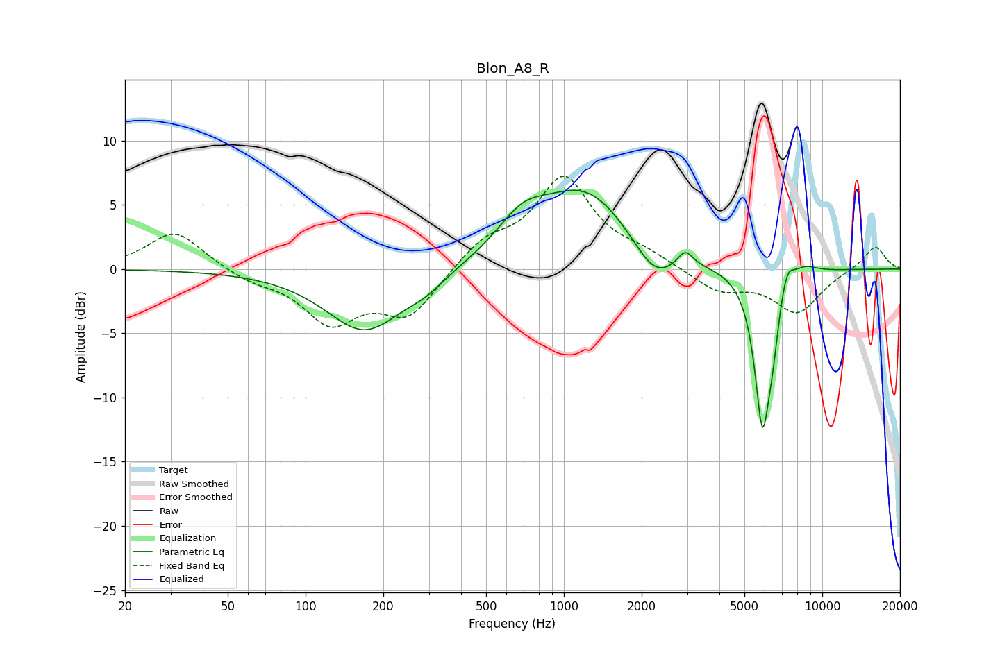

# Blon_A8_R
See [usage instructions](https://github.com/jaakkopasanen/AutoEq#usage) for more options and info.

### Parametric EQs
Apply preamp of -6.2 dB when using parametric equalizer.

|   # | Type    |   Fc (Hz) |    Q |   Gain (dB) |
|-----|---------|-----------|------|-------------|
|   1 | Peaking |       169 | 0.94 |        -4.9 |
|   2 | Peaking |       292 | 1.93 |        -0.8 |
|   3 | Peaking |       689 | 1.41 |         2.6 |
|   4 | Peaking |      1218 | 0.79 |         5.9 |
|   5 | Peaking |      2243 | 1.73 |        -2.7 |
|   6 | Peaking |      2950 | 4.78 |         1.3 |
|   7 | Peaking |      5871 | 4.33 |       -12   |
|   8 | Peaking |      6429 | 6    |        -2.5 |
|   9 | Peaking |      7301 | 5.09 |         1.8 |
|  10 | Peaking |      8534 | 2.73 |         0.7 |

### Fixed Band EQs
When using fixed band (also called graphic) equalizer, apply preamp of **-7.3 dB** (if available) and set gains manually with these parameters.

|   # | Type    |   Fc (Hz) |    Q |   Gain (dB) |
|-----|---------|-----------|------|-------------|
|   1 | Peaking |        31 | 1.41 |         3   |
|   2 | Peaking |        62 | 1.41 |        -0.8 |
|   3 | Peaking |       125 | 1.41 |        -3.9 |
|   4 | Peaking |       250 | 1.41 |        -3.6 |
|   5 | Peaking |       500 | 1.41 |         2   |
|   6 | Peaking |      1000 | 1.41 |         6.9 |
|   7 | Peaking |      2000 | 1.41 |         0.9 |
|   8 | Peaking |      4000 | 1.41 |        -1.7 |
|   9 | Peaking |      8000 | 1.41 |        -3.3 |
|  10 | Peaking |     16000 | 1.41 |         1.9 |

### Graphs

