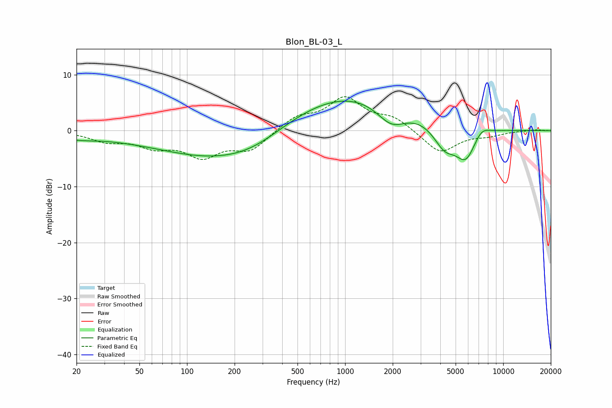

# Blon_BL-03_L
See [usage instructions](https://github.com/jaakkopasanen/AutoEq#usage) for more options and info.

### Parametric EQs
Apply preamp of -5.4 dB when using parametric equalizer.

|   # | Type    |   Fc (Hz) |    Q |   Gain (dB) |
|-----|---------|-----------|------|-------------|
|   1 | Peaking |        20 | 1.24 |        -0.9 |
|   2 | Peaking |        36 | 0.58 |        -0.5 |
|   3 | Peaking |       169 | 0.37 |        -5.2 |
|   4 | Peaking |       266 | 0.76 |        -1.4 |
|   5 | Peaking |       389 | 0.62 |        -0.1 |
|   6 | Peaking |      1032 | 0.3  |         7.3 |
|   7 | Peaking |      1962 | 1.46 |        -4.1 |
|   8 | Peaking |      4262 | 1.88 |        -4.4 |
|   9 | Peaking |      5808 | 2.09 |        -5.6 |
|  10 | Peaking |      7270 | 2.68 |         1.7 |

### Fixed Band EQs
When using fixed band (also called graphic) equalizer, apply preamp of **-6.2 dB** (if available) and set gains manually with these parameters.

|   # | Type    |   Fc (Hz) |    Q |   Gain (dB) |
|-----|---------|-----------|------|-------------|
|   1 | Peaking |        31 | 1.41 |        -1.7 |
|   2 | Peaking |        62 | 1.41 |        -2.4 |
|   3 | Peaking |       125 | 1.41 |        -4.2 |
|   4 | Peaking |       250 | 1.41 |        -3.3 |
|   5 | Peaking |       500 | 1.41 |         2.3 |
|   6 | Peaking |      1000 | 1.41 |         5.6 |
|   7 | Peaking |      2000 | 1.41 |         2.1 |
|   8 | Peaking |      4000 | 1.41 |        -4.1 |
|   9 | Peaking |      8000 | 1.41 |        -0.7 |
|  10 | Peaking |     16000 | 1.41 |         0.2 |

### Graphs

