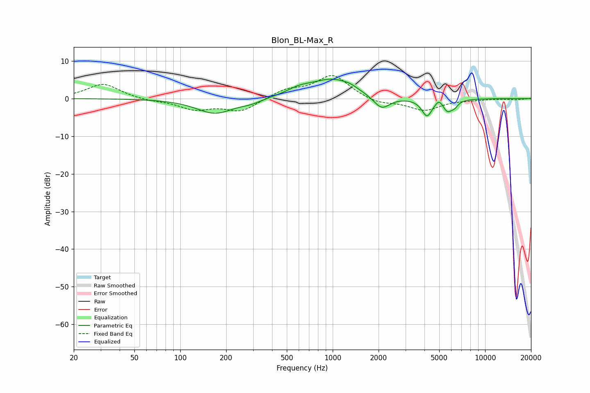

# Blon_BL-Max_R
See [usage instructions](https://github.com/jaakkopasanen/AutoEq#usage) for more options and info.

### Parametric EQs
Apply preamp of -5.2 dB when using parametric equalizer.

|   # | Type    |   Fc (Hz) |    Q |   Gain (dB) |
|-----|---------|-----------|------|-------------|
|   1 | Peaking |       169 | 1.16 |        -4   |
|   2 | Peaking |       289 | 2.03 |        -0.8 |
|   3 | Peaking |       600 | 1.71 |         1.5 |
|   4 | Peaking |       998 | 0.98 |         5   |
|   5 | Peaking |      1298 | 3.37 |         0.5 |
|   6 | Peaking |      2092 | 2.6  |        -3.6 |
|   7 | Peaking |      4156 | 4.13 |        -4.6 |
|   8 | Peaking |      4994 | 6    |         1.6 |
|   9 | Peaking |      5665 | 4.22 |        -3   |
|  10 | Peaking |      6307 | 6    |        -1.2 |

### Fixed Band EQs
When using fixed band (also called graphic) equalizer, apply preamp of **-6.2 dB** (if available) and set gains manually with these parameters.

|   # | Type    |   Fc (Hz) |    Q |   Gain (dB) |
|-----|---------|-----------|------|-------------|
|   1 | Peaking |        31 | 1.41 |         4   |
|   2 | Peaking |        62 | 1.41 |        -0.6 |
|   3 | Peaking |       125 | 1.41 |        -2.7 |
|   4 | Peaking |       250 | 1.41 |        -3.3 |
|   5 | Peaking |       500 | 1.41 |         2.2 |
|   6 | Peaking |      1000 | 1.41 |         6.2 |
|   7 | Peaking |      2000 | 1.41 |        -1.5 |
|   8 | Peaking |      4000 | 1.41 |        -3.1 |
|   9 | Peaking |      8000 | 1.41 |        -0.2 |
|  10 | Peaking |     16000 | 1.41 |        -0.3 |

### Graphs

