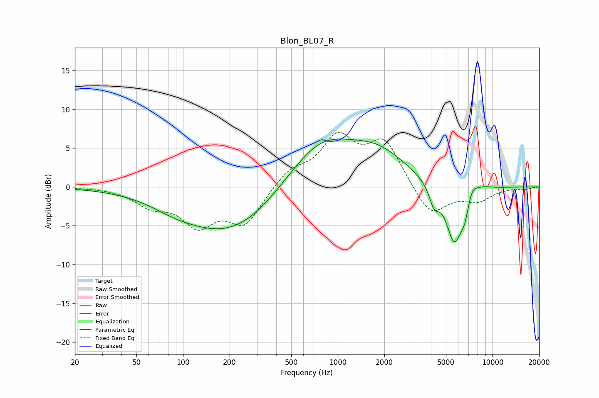

# Blon_BL07_R
See [usage instructions](https://github.com/jaakkopasanen/AutoEq#usage) for more options and info.

### Parametric EQs
Apply preamp of -6.3 dB when using parametric equalizer.

|   # | Type    |   Fc (Hz) |    Q |   Gain (dB) |
|-----|---------|-----------|------|-------------|
|   1 | Peaking |        87 | 1.08 |        -0.7 |
|   2 | Peaking |       196 | 0.46 |        -6   |
|   3 | Peaking |       292 | 1.28 |        -0.2 |
|   4 | Peaking |       775 | 0.64 |         6.1 |
|   5 | Peaking |      1850 | 0.75 |         3.5 |
|   6 | Peaking |      4196 | 4.58 |        -2.4 |
|   7 | Peaking |      5686 | 2.41 |        -7.7 |
|   8 | Peaking |      6620 | 5.97 |        -1.6 |
|   9 | Peaking |      7403 | 4.07 |         1.5 |
|  10 | Peaking |      8588 | 2.23 |         0.5 |

### Fixed Band EQs
When using fixed band (also called graphic) equalizer, apply preamp of **-7.1 dB** (if available) and set gains manually with these parameters.

|   # | Type    |   Fc (Hz) |    Q |   Gain (dB) |
|-----|---------|-----------|------|-------------|
|   1 | Peaking |        31 | 1.41 |        -0   |
|   2 | Peaking |        62 | 1.41 |        -2.1 |
|   3 | Peaking |       125 | 1.41 |        -4.5 |
|   4 | Peaking |       250 | 1.41 |        -4.6 |
|   5 | Peaking |       500 | 1.41 |         2   |
|   6 | Peaking |      1000 | 1.41 |         6   |
|   7 | Peaking |      2000 | 1.41 |         5.7 |
|   8 | Peaking |      4000 | 1.41 |        -4   |
|   9 | Peaking |      8000 | 1.41 |        -1.6 |
|  10 | Peaking |     16000 | 1.41 |        -0.3 |

### Graphs

