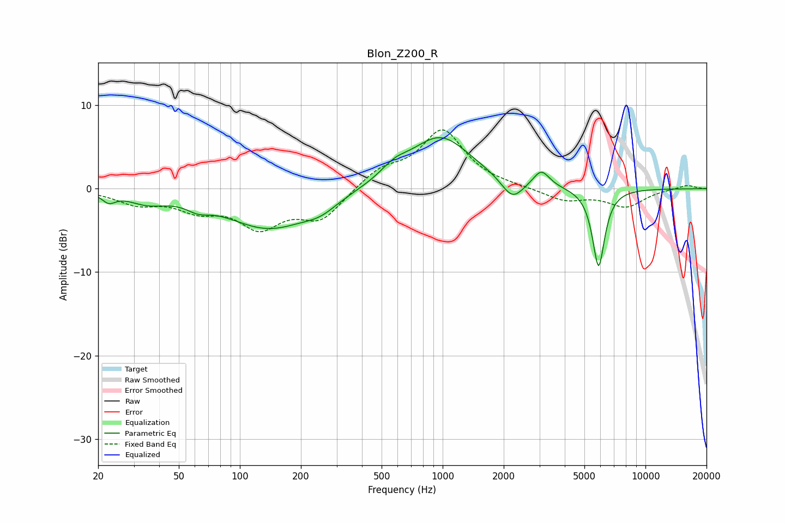

# Blon_Z200_R
See [usage instructions](https://github.com/jaakkopasanen/AutoEq#usage) for more options and info.

### Parametric EQs
Apply preamp of -6.2 dB when using parametric equalizer.

|   # | Type    |   Fc (Hz) |    Q |   Gain (dB) |
|-----|---------|-----------|------|-------------|
|   1 | Peaking |        23 | 4.44 |        -1.1 |
|   2 | Peaking |        35 | 1.53 |        -1.3 |
|   3 | Peaking |        62 | 2.62 |        -0.9 |
|   4 | Peaking |       139 | 0.67 |        -4.7 |
|   5 | Peaking |       249 | 1.71 |        -1.2 |
|   6 | Peaking |       577 | 2.13 |         1.3 |
|   7 | Peaking |       973 | 0.91 |         6.3 |
|   8 | Peaking |      2208 | 2.63 |        -2.5 |
|   9 | Peaking |      3064 | 3.56 |         2   |
|  10 | Peaking |      5873 | 4.54 |        -9.5 |

### Fixed Band EQs
When using fixed band (also called graphic) equalizer, apply preamp of **-7.1 dB** (if available) and set gains manually with these parameters.

|   # | Type    |   Fc (Hz) |    Q |   Gain (dB) |
|-----|---------|-----------|------|-------------|
|   1 | Peaking |        31 | 1.41 |        -1.6 |
|   2 | Peaking |        62 | 1.41 |        -2.1 |
|   3 | Peaking |       125 | 1.41 |        -4.2 |
|   4 | Peaking |       250 | 1.41 |        -3.5 |
|   5 | Peaking |       500 | 1.41 |         2.1 |
|   6 | Peaking |      1000 | 1.41 |         6.9 |
|   7 | Peaking |      2000 | 1.41 |         0.2 |
|   8 | Peaking |      4000 | 1.41 |        -1.4 |
|   9 | Peaking |      8000 | 1.41 |        -2.1 |
|  10 | Peaking |     16000 | 1.41 |         0.5 |

### Graphs

